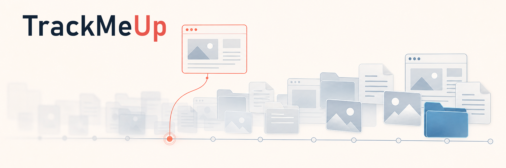
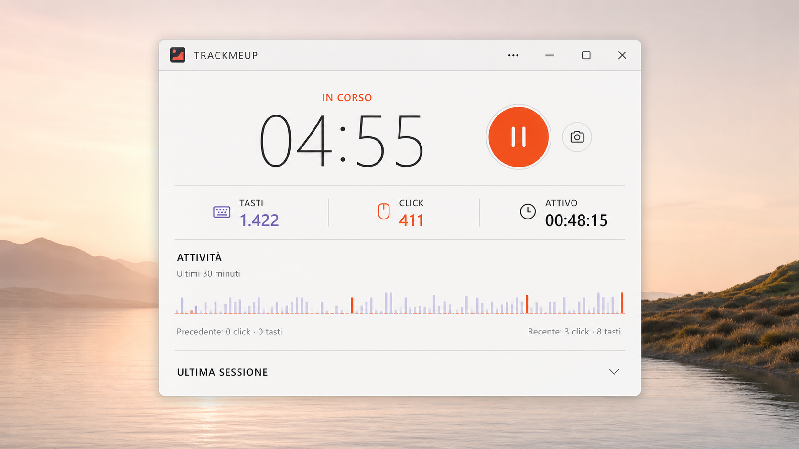
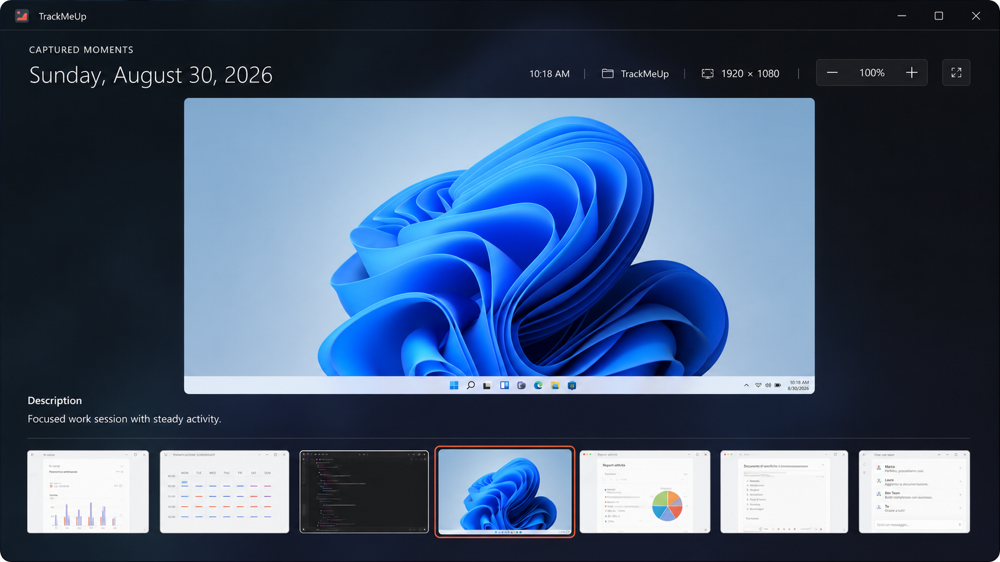
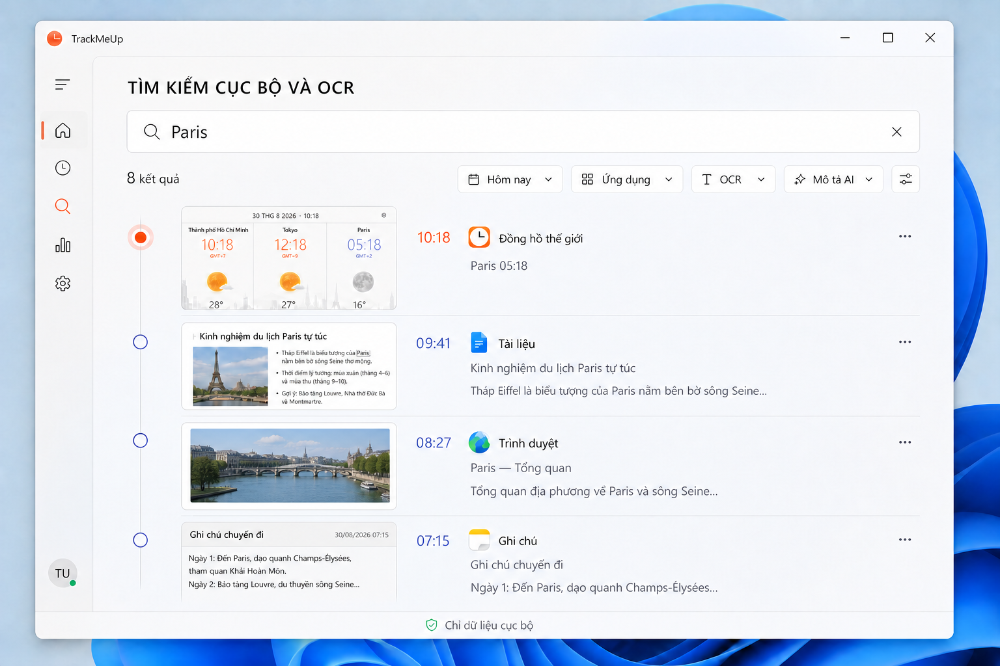
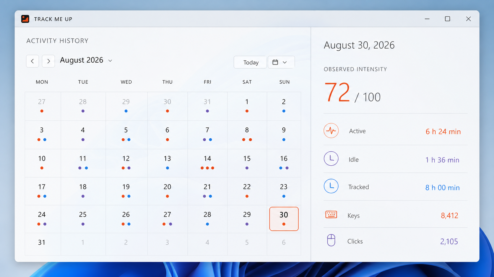
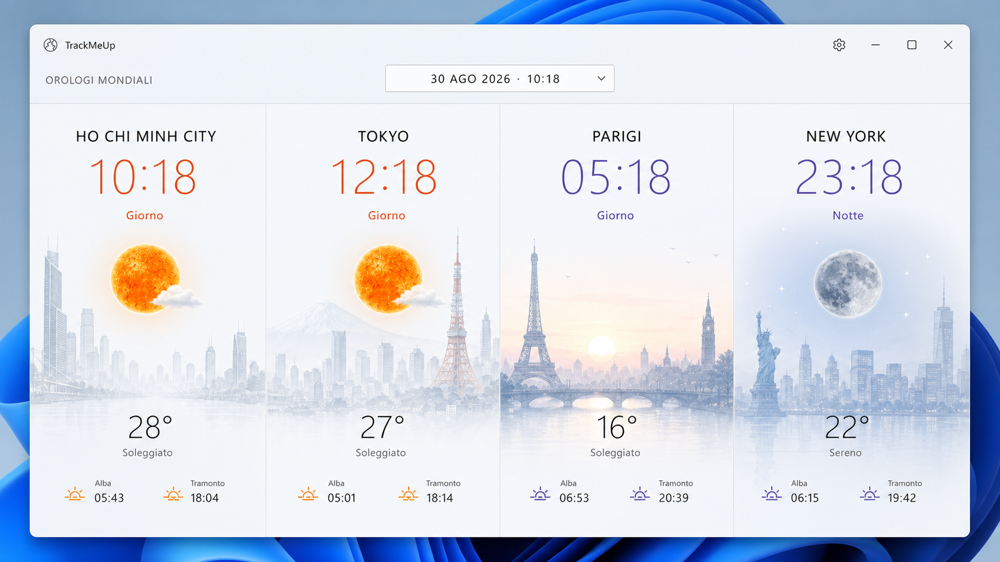
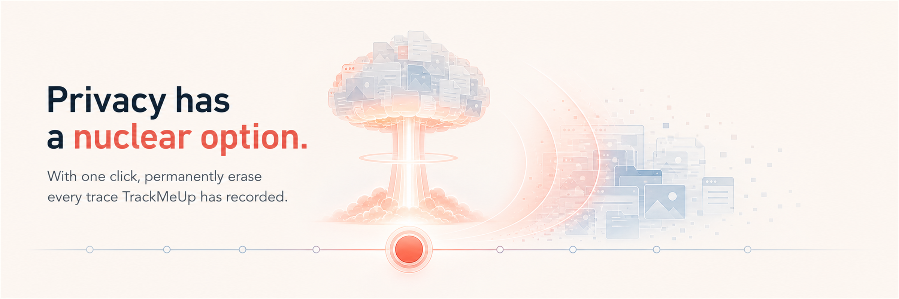

  <picture>
    <source media="(prefers-color-scheme: dark)" srcset="design/branding/recall-timeline/output/trackmeup-recall-timeline-banner-theme-dark-readme-2400x800.png" />
    <source media="(prefers-color-scheme: light)" srcset="design/branding/recall-timeline/output/trackmeup-recall-timeline-banner-theme-light-readme-2400x800.png" />
    
  </picture>

<h1 align="center">TrackMeUp — Private, local-first activity tracker for Windows</h1>

<strong>Your workday, searchable. Your history, local by default.</strong>

  A private, local-first activity tracker and searchable workday memory for Windows.
  Recover lost context, search captured moments, and understand how your day unfolded—without a TrackMeUp account or hidden cloud sync.

  <a href="https://umbertogiacobbi.biz/trackmeup/?utm_source=github&amp;utm_medium=referral&amp;utm_campaign=trackmeup&amp;utm_content=readme_product_page"><strong>Product page</strong></a>
  ·
  <a href="#remember-the-moment-not-the-tab"><strong>Explore the product</strong></a>
  ·
  <a href="#get-trackmeup"><strong>Build locally</strong></a>
  ·
  <a href="docs/PRIVACY.md"><strong>Read the privacy model</strong></a>

  
  
  
  

> [!IMPORTANT]
> **Beta 1 is coming soon.** We are using the next two months to carefully evaluate AI and privacy risks before publishing the first public beta.

## Remember the moment, not the tab

TrackMeUp is built for the moment when you know you saw something today, but cannot remember which app, window, or part of the day it belonged to.

<table>
  <tr>
    <td width="33%">
      <strong>Find it again</strong> 
      Search activity, applications, window titles, screenshots, local OCR, and optional AI descriptions from one compact recall surface.
    </td>
    <td width="33%">
      <strong>Resume faster</strong> 
      Reconstruct what was active before an interruption instead of rebuilding context from browser history and open tabs.
    </td>
    <td width="33%">
      <strong>See the shape of your day</strong> 
      Compare active time, idle periods, applications, activity signals, daily reports, and longer-term trends.
    </td>
  </tr>
</table>

TrackMeUp does **not** store the content of what you type. It retains only non-content activity signals, such as input counts, needed to distinguish active work from idle time.

## TrackMeUp in action

These promotional product previews use synthetic demo data and show the English, Italian, and Vietnamese interfaces.

  
   
  <strong>Live tracking · Italiano</strong> — elapsed time, non-content input counts, and recent activity at a glance.

<table>
  <tr>
    <td width="50%" valign="top">
      
       
      <strong>Captured moments · English</strong> — inspect one retained screenshot and move through the full-width timeline.
    </td>
    <td width="50%" valign="top">
      
       
      <strong>Local search and OCR · Tiếng Việt</strong> — recover context across applications, screenshots, OCR, and optional AI descriptions.
    </td>
  </tr>
  <tr>
    <td width="50%" valign="top">
      
       
      <strong>Activity history · English</strong> — review observed activity intensity and exact daily signals without productivity scoring.
    </td>
    <td width="50%" valign="top">
      
       
      <strong>World clocks · Italiano</strong> — compare local time, astronomy, and optional current weather across cities.
    </td>
  </tr>
</table>

## How TrackMeUp works

1. **Observe locally.** TrackMeUp records time, active or idle state, application and window context, input counts, and selected system telemetry on this PC.
2. **Enrich only when you choose.** Screenshots, on-device OCR, and AI-provider analysis are independent options rather than prerequisites.
3. **Recall on demand.** Search your local history, inspect the original snapshot, review the timeline, or generate a daily report and digest.
4. **Merge installations explicitly.** A private `.tmuarchive` can carry SQLite history and retained screenshots between installations; preview and confirmation happen before merge, while machine identity plus a friendly name, color, and icon preserve provenance.

The desktop experience is paired with a PowerShell-friendly CLI, so the same application behavior is available to people and automation without creating a second tracking runtime.

The desktop app, reports, and human-readable CLI output can follow the Windows language or use `en-US`, `it-IT`, `fr-FR`, `de-DE`, `es-ES`, `zh-Hans`, `vi-VN`, `ko-KR`, `pt-PT`, or `pt-BR`. European and Brazilian Portuguese use separate product catalogs.

Display, search, and OCR languages are configured independently. Search supports every product locale; OCR offers only the corresponding Windows recognizer choices and requires the selected language pack to be installed. Vietnamese remains available for the interface and search but is not offered as a Windows OCR language.

## Privacy you can act on

  <picture>
    <source media="(prefers-color-scheme: dark)" srcset="design/branding/atomic-nuke/output/trackmeup-atomic-privacy-banner-v2-dark-erasure-wave-2400x800.png" />
    <source media="(prefers-color-scheme: light)" srcset="design/branding/atomic-nuke/output/trackmeup-atomic-privacy-banner-v3-light-radial-reset-2400x800.png" />
    
  </picture>

Privacy should feel like control, not a policy page. TrackMeUp keeps your workday memory on your PC and lets you decide what is remembered, for how long, and when it is time to start over.

- **No account required.** Open TrackMeUp and your workday memory is yours.
- **Nothing is quietly synced.** There is no hidden TrackMeUp cloud collecting your activity.
- **More context is always your choice.** Screenshots, AI assistance, and location sharing wait for you to turn them on.
- **Some moments can stay private.** Leave selected apps, windows, and details out of the story.
- **Old memories fade on your schedule.** You choose how long TrackMeUp keeps them.
- **A clean slate is built in.** The **Nuclearize everything** button permanently erases everything TrackMeUp has kept on this PC and restarts the app as new. Two deliberate confirmations protect against an accidental click.

Files you already exported or shared remain outside TrackMeUp's reach.

For the complete data-flow and dependency inventory, see [Privacy and Data Flow](docs/PRIVACY.md).

## Choose the recall you want

Screenshots and AI are separate choices. Start with the smallest footprint that solves your problem and enable more context only when it earns its place.

| Setup | What it adds | What leaves this PC |
| --- | --- | --- |
| **Activity timeline** | Active and idle periods, application and window context, reports | Nothing unless optional diagnostics are enabled |
| **Visual recall** | Local screenshots and on-device OCR | Nothing unless optional diagnostics are enabled |
| **AI-assisted recall** | Optional descriptions or OCR refinement from your configured AI provider | Only the data included in an enabled provider request, plus optional diagnostics if enabled |

This table describes background product behavior. Export, Windows sharing, and
redacted-log sharing send only the material you explicitly choose.

Provider keys stay local and are never accepted through command-line arguments. Shared AI features remain provider-agnostic; you choose the supported provider and model that fit your workflow.

## Get TrackMeUp

> [!NOTE]
> TrackMeUp is currently pre-production. Public binary releases are not published yet; the supported early-access path is to build it from source.

Requirements:

- Windows 10 version 1809 or later.
- PowerShell 7.
- .NET 10 SDK.
- x64, x86, or ARM64.

~~~powershell
git clone https://github.com/umbertotechnopreneur/TrackMeUp.git
Set-Location .\TrackMeUp
pwsh -NoProfile -File .\scripts\TrackMeUp.ps1 -Action Preflight
pwsh -NoProfile -File .\scripts\TrackMeUp.ps1 -Action Build -Platform x64 -WarnAsError
~~~

To produce a self-contained unpackaged build:

~~~powershell
pwsh -NoProfile -File .\scripts\TrackMeUp.ps1 -Action PublishUnpackaged -Platform x64
~~~

The utility recreates a clean platform-specific payload in `artifacts/unpackaged/<platform>/` so stale trimmed or ReadyToRun files cannot survive between publishes.

The same utility can create a sideloadable MSIX or installer when release packaging is required. Package layouts are written to `artifacts/packages/`; final installers are written to `artifacts/installers/`.

On Windows, `PackageMsix` and `CreateInstaller` sign the package automatically with the local TrackMeUp test certificate (`CN=umber`). If it is missing, the script creates it in the current user's certificate store, exports the public certificate to `artifacts/certificates/TrackMeUp-Test-Signing.cer`, and trusts it for the current user. To use another certificate already installed in `Cert:\CurrentUser\My`, pass `-PackageCertificateThumbprint <thumbprint>`. The test certificate is intended only for local sideloading; production releases must use a certificate issued for distribution.

## Power users and contributors

Installed-package CLI examples:

~~~powershell
trackmeup.exe -cli status
trackmeup.exe -cli tracking start
trackmeup.exe -cli report today
trackmeup.exe -cli ai status
trackmeup.exe -cli retention preview
~~~

Run `trackmeup.exe -cli` with no command in PowerShell 7 to open the interactive Spectre.Console command center. It shows the live local dashboard and offers tracking, AI, screenshot, report, diagnostics, settings, and desktop-app actions. The CLI always talks to the same shared TrackMeUp runtime as the desktop app; it does not start a second tracker or automate the graphical UI.

### CLI switches

Use `trackmeup.exe -cli --help` for the complete command reference. The following quick switches expand to their documented command and are convenient for daily use:

| Switch | Equivalent command | Purpose |
| --- | --- | --- |
| `--status` | `status` | Show the live tracking dashboard. |
| `--start` | `tracking start` | Start activity tracking. |
| `--pause` | `tracking pause` | Pause activity tracking. |
| `--toggle` | `tracking toggle` | Toggle activity tracking. |
| `--ai-on` | `ai enable` | Enable the configured AI provider. |
| `--ai-off` | `ai disable` | Disable AI analysis. |
| `--capture` | `screenshot capture` | Capture a privacy-checked screenshot. |
| `--report` | `report today` | Generate today's activity report. |
| `--doctor` | `doctor` | Run read-only diagnostics. |
| `--help` | `help` | Show help without connecting to the runtime. |
| `--version` | `version` | Show CLI and protocol versions without connecting to the runtime. |

Global output and safety switches can be combined with a command or quick switch:

| Switch | Purpose |
| --- | --- |
| `--format <rich|plain|json>` / `--json` | Select interactive, plain-text, or machine-readable output. |
| `--language <system|en-US|it-IT|fr-FR|de-DE|es-ES|zh-Hans|vi-VN|ko-KR|pt-PT|pt-BR>` | Select the CLI display locale. Language-only legacy values such as `en`, `pt`, and `zh` are rejected. |
| `--quiet`, `--verbose` | Reduce successful output or add diagnostics in plain mode. |
| `--yes` | Explicitly confirm a command that requires confirmation. |
| `--timeout <1-300>` | Set the shared-runtime connection timeout in seconds. |

Examples:

~~~powershell
trackmeup.exe -cli
trackmeup.exe -cli --ai-on
trackmeup.exe -cli --status --format json
trackmeup.exe -cli /ai --help
~~~

Repository automation:

~~~powershell
pwsh -NoProfile -File .\scripts\TrackMeUp.ps1
pwsh -NoProfile -File .\scripts\TrackMeUp.ps1 -Action Test -Platform x64 -WarnAsError
pwsh -NoProfile -File .\scripts\TrackMeUp.ps1 -Action BuildReports
pwsh -NoProfile -File .\scripts\TrackMeUp.ps1 -Action PackageMsix -Platform x64
pwsh -NoProfile -File .\scripts\TrackMeUp.ps1 -Action CreateInstaller -Platform x64
~~~

Start with [CONTRIBUTING.md](CONTRIBUTING.md), then use the [manual validation guide](docs/VALIDATION.md) for behavior and visual acceptance checks.

Search interaction check:

- [ ] Open local search, move focus to another window, and confirm it remains open without covering it. Enter at least three characters and confirm the local-index status and progress indicator appear until results are available, with no suggestion popup.
- [ ] In local search, select results by mouse and keyboard and verify the side preview updates its title, source, time, provenance, and highlighted text. Open the selected capture with Open snapshot or Enter. Clear the query or return no results: the previous preview must disappear. With more than 20 matches, verify the displayed/total count is explicit.
- [ ] Check local search on a narrow display and with Windows text scaling at 200%: the preview stacks below the result list when needed, both panes scroll vertically, and the footer and Open snapshot action remain reachable. Confirm the gradient stays still and selected-result changes never load screenshot thumbnails or query an AI provider.
- [ ] Open About from a non-primary display and verify that it centers on the player display with version, build date/time, and build commit all visible.
- [ ] Trigger informational, success, warning, and error feedback. Confirm every toast uses an opaque severity-colored surface and border, and its timeout bar stays inside the toast frame.
- [ ] Set main-window and World Clocks opacity to 25%, including the Operations surface: toast text, fill, border, and countdown must remain fully opaque. Trigger a removal just before a minute boundary and verify the toast keeps its full timeout through the refresh.
- [ ] Open a standard acknowledgement and a destructive confirmation. Confirm both are WinUI dialogs with localized `OK`/`Annulla` actions, and that dismissing a confirmation does not execute it.
- [ ] Resize the screenshot schedule from its 620 × 480 DIP minimum to a maximized window, including 200% text scaling. Confirm the Mica surface remains unobscured, the header actions reflow, all seven day columns fill the available width, empty quarter-hour cells show no dot, and mouse click/drag selection remains aligned with the pointer. On touch, a tap selects one cell while a vertical swipe scrolls without changing the schedule.
- [ ] Queue dialogs from two windows, close the waiting owner, then dismiss the active dialog: the closed owner's request must not appear. Exit with a dialog open and check that dialogs, pending requests, and toast timers are cleared. Check that a tray-hidden owner is restored for a standard dialog and its selected theme is respected.
- [ ] In World Clocks, choose a city and use **Aggiungi un altro**. Confirm the picker stays open, shows the `Orologio aggiunto` toast, removes that city from the choices, and accepts another addition; regular **Aggiungi orologio** should still close the picker.
- [ ] In World Clocks options, move cities up and down. Confirm the first up arrow and last down arrow are disabled, the reference city stays selected, the clock columns update immediately, and the new order survives closing and reopening the app.
- [ ] Launch the installed app with no TrackMeUp process running. Confirm the borderless player opens without a title-bar layout exception, its caption commands remain clickable, and a World Clocks window still reserves space for its native caption buttons at different display scales.
- [ ] Resize the player between its 470 × 240 DIP minimum and a wider/taller window. Confirm the background cannot enlarge the layout, the title-bar commands stay within the right edge, metrics and AI spend reflow in narrow windows, and taller content scrolls vertically. Toggle sections and switch between player/options: manually selected bounds must be retained for each surface; closing and reopening restores the player bounds.
- [ ] During a slow city addition, verify Cancel, Esc, native close, and additional submissions cannot close or mutate the picker concurrently. Shut down during the pending addition: no late toast or control update should target the closed picker.
- [ ] In World Clocks, confirm each city skyline fills its clock column up to the side edges. In a tall window, skyline, atmosphere, and fade must stay anchored together at the bottom, leaving space above once the scene reaches native resolution; widening the column may still scale the scene to fill its width.
- [ ] In World Clocks, search for every European capital and sample the expanded USA, Australia, and Russia groups. Confirm all capitals are selectable and each of those three countries exposes ten supported cities with seasonal skyline artwork.
- [ ] In World Clocks, search for Ferrara, Domegge di Cadore, Bologna, and samples from the added European and South American cities. Confirm every result is selectable and shows the matching summer/winter Urban Wash skyline.
- [ ] In World Clocks with one, two, and three cities, use the title-bar layout icon to switch between the compact widget and detailed comparison. Confirm the compact widget keeps time, weather, skyline, and atmosphere while omitting solar/lunar detail; confirm the window chooses the content-led size, still permits manual resizing, and horizontal scroll begins before columns become unreadable.
- [ ] Resize World Clocks from tall to short with one, two, and twelve cities, including Windows text scaling at 200% and long translated weather labels. Confirm columns fill the available width, time/weather reflow without overlapping, solar/lunar detail and then daylight duration progressively hide, date changes remain visible, and overflow remains scrollable. Enlarge again to reveal detail; the explicit compact choice must never reveal the solar arc.
- [ ] In World Clocks, reach the layout icon with Tab and activate it with Space. Verify the OpenWeather logo floats at the bottom right over the scene, without a full-width footer band or overlap with UTC/daylight text; its localized tooltip and accessible name must identify the attribution. Resize manually, close/reopen, and wait through a minute refresh: the saved bounds must remain. With a custom reference instant, add/remove a city in options and return: content sizing must apply without switching back to live time.
- [ ] Resize World Clocks repeatedly from wide/tall to the 480 × 240 DIP minimum, with two cities and at 100%, 150%, and 200% display scaling, including moving between monitors. Confirm skyline, atmosphere, and fade share the same bottom edge and stay clipped to their column; extra height must increase the space above the scene after its scale limit. In compact mode, no mandatory skyline spacer should prevent further height reduction; overflowing clock text must remain scrollable.
- [ ] Open the reference-instant panel in a narrow/short World Clocks window, then resize while it is open. Confirm date and time share one row. At 200% text scaling and with long translated labels, verify the title, city, date, time, and time-zone text fit or scroll vertically, while Restore now and Apply remain visible and usable. Verify the title uses the selected UI language.
- [ ] In World Clocks, use the globe icon in the title bar to show and hide the additional bottom panel. Confirm the window grows without compressing unreadable clock columns; the map follows the selected reference instant and shows distinct night, dawn, day, and sunset zones, the Sun, the Moon with its current phase, and markers for every selected city. Verify the globe icon tooltip and accessible name switch between the localized show and hide actions.

Privacy and runtime regression checks:

- [ ] Exclude a synthetic process/title/context and verify no activity is stored; disable each detail provider and verify titles/attributes are absent.
- [ ] With an excluded window on another monitor, verify the entire screenshot is blocked. Use only synthetic content for this manual Windows check.
- [ ] Interrupt screenshot deletion after file removal, retry/restart, and verify OCR and active search/suggestion documents disappear. Retention must also expire OCR whose image is already absent.
- [ ] Hold an AI test provider pending: pause and AI-disable must complete promptly and cancel the request. AI-off/another-provider mode must not download the OpenAI pricing table.
- [ ] Update one search document and verify suggestion lookup does not rebuild/write the index; incomplete test IPC frames must time out and release their bounded slots.

## Project documentation

- [Privacy and data flow](docs/PRIVACY.md)
- [Architecture](docs/ARCHITECTURE.md)
- [Manual validation guide](docs/VALIDATION.md)
- [Public roadmap](ROADMAP.md)
- [Project governance](GOVERNANCE.md)
- [Changelog](CHANGELOG.md)
- [CLI implementation plan](docs/CLI_IMPLEMENTATION_PLAN.md)
- [Security policy](SECURITY.md)
- [Support](SUPPORT.md)
- [Code of conduct](CODE_OF_CONDUCT.md)
- [AI contribution policy](AI_CONTRIBUTION_POLICY.md)
- [IP provenance](IP_PROVENANCE.md)
- [Asset licensing and provenance](ASSET_LICENSING.md)
- [Third-party notices](THIRD_PARTY_NOTICES.md)
- [Trademark and brand policy](TRADEMARKS.md)
- [Publication checklist](PUBLICATION_CHECKLIST.md)

The About window provides quick access to the log folder, issue tracker, product links, and the runtime third-party license inventory.

## Repository map

- <code>TrackMeUp/</code> — Windows desktop app and composition root.
- <code>TrackMeUp.Core/</code> — application behavior, persistence, capture, AI adapters, and runtime ownership.
- <code>TrackMeUp.Presentation/</code> — UI-neutral models for desktop surfaces.
- <code>TrackMeUp.Cli/</code> — PowerShell-facing CLI.
- <code>TrackMeUp.Reports.Web/</code> — local reports web assets.
- <code>TrackMeUp.*.Tests/</code> — automated test projects.
- <code>scripts/TrackMeUp.ps1</code> — shared automation entrypoint.
- <code>docs/</code> — privacy, validation, and implementation documentation.
- <code>store/</code> — Store copy and release-support material.

## License

Unless a file says otherwise, TrackMeUp's project-authored source code and
documentation are open source under the [MIT License](LICENSE). The license
permits use, modification, distribution, sublicensing, and commercial use,
provided its copyright and permission notice are retained.

First-party C# files carry the concise `SPDX-License-Identifier: MIT` header;
the complete license text remains authoritative here at the repository root.

The MIT License does not grant rights to the TrackMeUp name, logos, wordmarks,
app icons, or other official brand artwork. Forks and redistributions must
follow the [Trademark and Brand Policy](TRADEMARKS.md) and avoid implying that
they are official or endorsed by the TrackMeUp project.

Third-party components, data, and assets retain their own license terms. Review
[Third-Party Notices](THIRD_PARTY_NOTICES.md), the
[asset licensing record](ASSET_LICENSING.md), and any adjacent attribution or
provenance file before redistributing repository material or packaged binaries.

---

<strong>MORE FROM UMBERTO</strong>

<h2 align="center">Good ideas deserve great tools.</h2>

  Enjoying TrackMeUp? Discover more ways to put AI to work, explore new perspectives, 
  and turn your next big idea into something people can use.

<table>
  <tr>
    <td width="33%" valign="top">
      <h3>⌨️ PromptMeUp</h3>
      
<strong>Less command hunting. More getting things done.</strong>

      
Your AI companion for the terminal: describe what you need, understand the next step, and review the exact command before you choose to run it.

      
<a href="https://github.com/umbertotechnopreneur/PromptMeUp"><strong>Meet PromptMeUp →</strong></a>

    </td>
    <td width="33%" valign="top">
      <h3>🔎 ViewsApp.ai</h3>
      
<strong>One topic. Many AI perspectives.</strong>

      
Explore how different AI models interpret people, events, and narratives. Compare their perspectives, spot common ground, and discover where the stories diverge.

      
<a href="https://www.viewsapp.ai/?utm_source=github&amp;utm_medium=referral&amp;utm_campaign=trackmeup&amp;utm_content=readme_more_views"><strong>Explore Views →</strong></a>

    </td>
    <td width="33%" valign="top">
      <h3>🚀 Umberto Giacobbi</h3>
      
<strong>Big ambition? Let's build what's next.</strong>

      
Meet the builder behind these projects. Explore my work as a fractional CTO, software developer, and technopreneur—from product strategy and architecture to hands-on execution.

      
<a href="https://umbertogiacobbi.biz/?utm_source=github&amp;utm_medium=referral&amp;utm_campaign=trackmeup&amp;utm_content=readme_author_cta"><strong>Let's talk about your next idea →</strong></a>

    </td>
  </tr>
</table>

<em>Better tools. Fresh perspectives. More room for your next big idea.</em>

