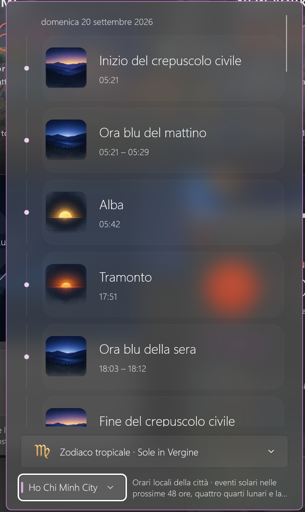
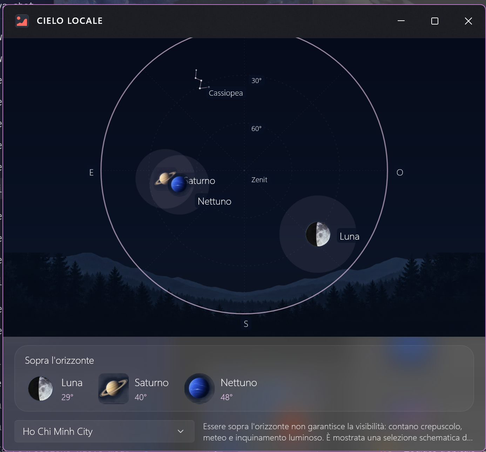
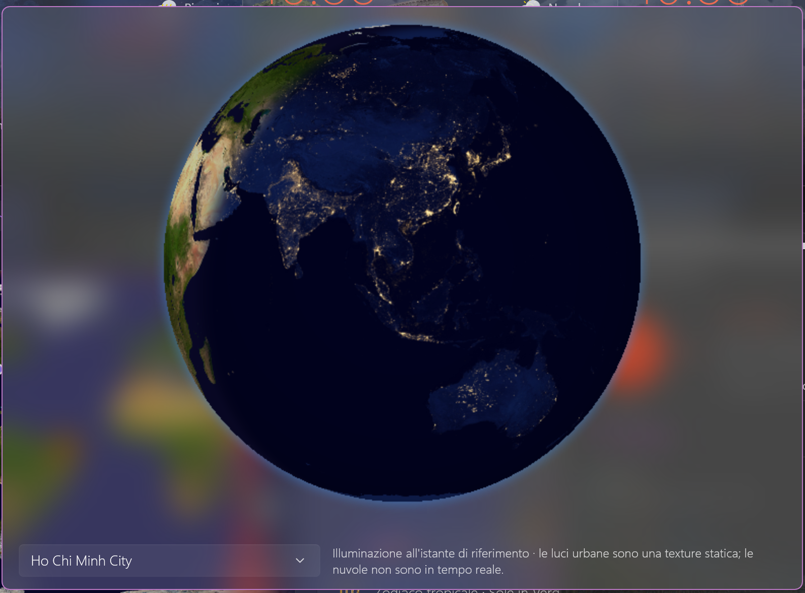
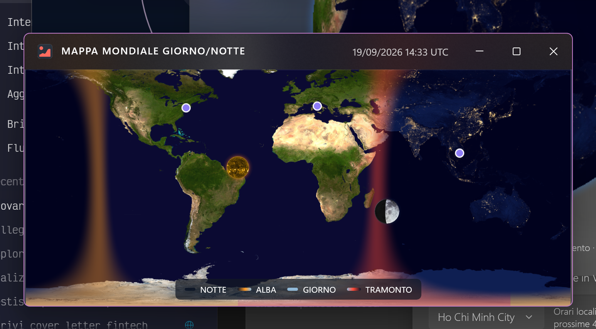
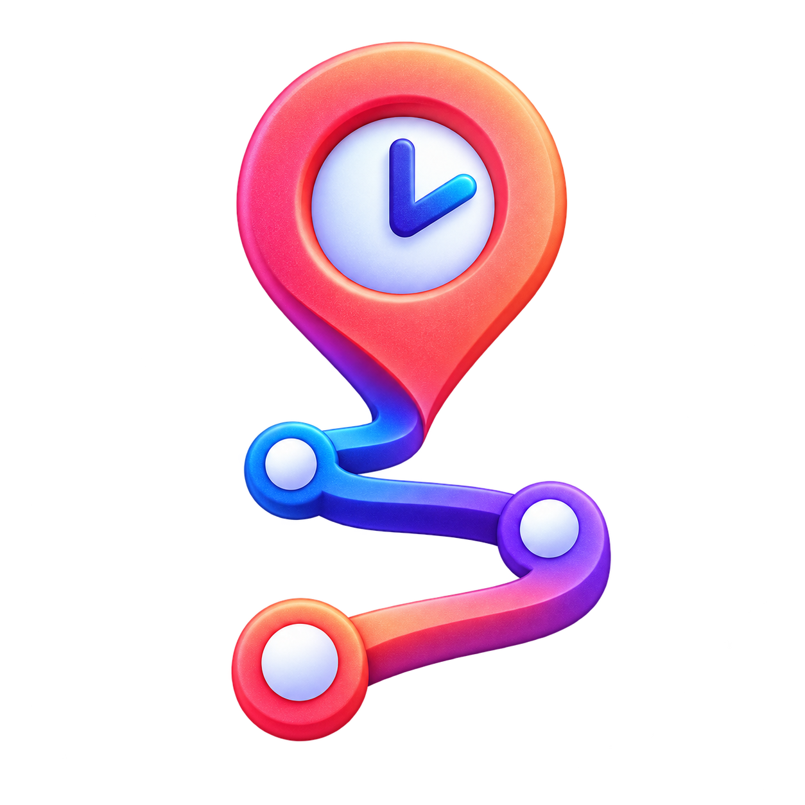

# TrackMeUp — Track your time. Find what you worked on.

Search your Windows activity and optional screenshots, with history stored on your PC by default. Find an app or document from earlier in your day and see where your time went.

**[Get started](#get-trackmeup)** · [See what it does](#remember-the-moment-not-the-tab) · [Sky and weather extras](#extras-sky-weather-and-world-clocks) · [Privacy](docs/PRIVACY.md)

No TrackMeUp account needed. Screenshots and AI analysis are separate options.

  
   
  <strong>Live tracking · Italiano</strong> — see elapsed time, key-press and click counts, and recent activity.

*Actual app preview with sample data, shown in Italian.*

> [!TIP]
> **Hardcore users: a full CLI interface, in the MeUp tradition — Premium only.** TrackMeUp Premium gives you an interactive command center, one-shot commands and JSON output for activity tracking, search, reports, screenshots, data archives and AI operations. The Free edition does not include CLI access.
>
> Start with `trackmeup.exe -cli --help` in PowerShell 7, or try `trackmeup.exe -cli search query --text "project" --json`. See the [CLI guide and examples](docs/CLI_EXAMPLES.md) for commands and confirmations. For a source build, use the executable’s full path; celestial views and window controls stay in the desktop UI.

## Get TrackMeUp

TrackMeUp is in development and has no public download yet. Build from source to try it.

You'll need:

- Windows 10 version 1809 or later.
- PowerShell 7.
- .NET 10 SDK.
- x64 or ARM64.

~~~powershell
git clone https://github.com/umbertotechnopreneur/TrackMeUp.git
Set-Location .\TrackMeUp
pwsh -NoProfile -File .\scripts\TrackMeUp.ps1 -Action Preflight
pwsh -NoProfile -File .\scripts\TrackMeUp.ps1 -Action Build -Platform x64 -WarnAsError
~~~

To produce a self-contained unpackaged build:

~~~powershell
pwsh -NoProfile -File .\scripts\TrackMeUp.ps1 -Action PublishUnpackaged -Platform x64
~~~

Open `TrackMeUp.exe` from the folder created under `artifacts/unpackaged/<version>/<platform>/`. Keep all its files together. The runtime is included, and your history is stored separately in `%LOCALAPPDATA%\TrackMeUp`. See the [packaging guide](docs/RELEASING.md) for portable ZIPs and release options.

## Before you start

> [!IMPORTANT]
> **Portable limitation:** on-device screenshot OCR requires MSIX package identity and is unavailable in the portable edition; failed OCR is recorded without discarding the screenshot.
>
> OCR is initialized when text extraction is requested. The x64 portable has passed an extracted `--version` launch check; full UI startup on clean x64/ARM64 machines remains a separate release check. See [portable requirements and verification](docs/RELEASING.md#portable-startup-and-feature-limitations).

> [!NOTE]
> **MSIX installers are temporarily unavailable.** I'm working on the code-signing certificate needed to distribute them. Use an unpackaged build for now.

Portable executables can run directly. MSIX packages require signing before installation. See the [release guide](docs/RELEASING.md) for package details.

  
  
  
  

> [!IMPORTANT]
> **The first public beta is in preparation.** I'm checking how the app handles AI and private data before publishing it.

## Remember the moment, not the tab

You know you saw it today. Was it in the browser, a document, or another app? TrackMeUp gives you a way to retrace your steps.

<table>
  <tr>
    <td width="33%">
      <strong>Find it again</strong> 
      Search your activity, app names, window titles, saved screenshots, text read from images (OCR), and optional AI descriptions in one place.
    </td>
    <td width="33%">
      <strong>Pick up where you left off</strong> 
      Check what you were working on before a call, a break, or an interruption.
    </td>
    <td width="33%">
      <strong>See where your time went</strong> 
      Look back at the apps you used and time spent active or away. Compare days in the activity calendar to spot patterns.
    </td>
  </tr>
</table>

TrackMeUp counts key presses and mouse clicks to tell active time from idle time. It **doesn't record which keys you press or what you type**. Screenshots are a separate option and can include text visible on screen.

## TrackMeUp in action

These previews use made-up demo data and show the app in English, Italian, and Vietnamese.

<table>
  <tr>
    <td width="50%" valign="top">
      
       
      <strong>Captured moments · English</strong> — open a saved screenshot and browse nearby moments on the timeline.
    </td>
    <td width="50%" valign="top">
      
       
      <strong>Local search and OCR · Tiếng Việt</strong> — find something by its app, screenshot text, or optional AI description.
    </td>
  </tr>
  <tr>
    <td width="50%" valign="top">
      
       
      <strong>Activity history · English</strong> — see when you were active and check the daily numbers. These aren't productivity scores.
    </td>

  </tr>
</table>

## How TrackMeUp works

1. **Track your day.** TrackMeUp saves active and idle time, app and window details, key-press and click counts, and selected system measurements on this PC.
2. **Choose what else to save.** Screenshots, text recognition on your PC, and analysis by an AI provider are separate options. You can use the tracker without them.
3. **Look back when you need to.** Search your history, open a screenshot, browse the timeline, or compare days in the activity calendar.
4. **Bring history from another installation.** Export a `.tmuarchive` with your history and, if you choose, saved screenshots. You can preview it before confirming an import. Each installation keeps its own identity, name, color, and icon so you can tell where the records came from.

Prefer the terminal? There's also a command-line interface (CLI) for PowerShell and scripts. It controls the same tracker as the desktop app.

### Built for Windows

TrackMeUp uses WinUI and native Windows controls for the desktop app and activity calendar.

The app and readable CLI output can follow your Windows language. You can also choose English, Italian, French, German, Spanish, Simplified Chinese, Vietnamese, Korean, European Portuguese, or Brazilian Portuguese.

You can choose separate languages for the interface, search, and text recognition (OCR). Search supports all the app's languages. OCR needs a supported Windows language pack installed on your PC. Vietnamese works for the interface and search, but isn't available for Windows OCR.

Search also understands 300 curated concepts in each supported language, with synonyms for documents, messages, meetings, development, spreadsheets, payments, and more. For example, Italian `copia di sicurezza progetto` can also find `backup progetto`. Synonyms work locally and can be turned off in search settings.

## You're in control of your data

  <picture>
    <source media="(prefers-color-scheme: dark)" srcset="design/branding/atomic-nuke/output/trackmeup-atomic-privacy-banner-v2-dark-erasure-wave-2400x800.png" />
    <source media="(prefers-color-scheme: light)" srcset="design/branding/atomic-nuke/output/trackmeup-atomic-privacy-banner-v3-light-radial-reset-2400x800.png" />
    
  </picture>

You choose what TrackMeUp saves, how long it keeps it, and when to delete it.

- **No account needed.** You can use the app without signing up.
- **No hidden sync.** TrackMeUp doesn't upload your activity to its own cloud.
- **Optional extras.** Screenshots, AI assistance, and location sharing stay off until you turn them on.
- **Privacy rules.** Exclude selected apps, windows, or details from tracking.
- **Your schedule.** Choose how many days to keep your history and screenshots.
- **Start fresh.** **Nuclearize everything** deletes this installation's saved data and restarts the app with default settings. It asks you to confirm twice to avoid an accidental reset.

The reset doesn't remove exported or shared files, copies held by other services, API keys in Windows environment variables, or Windows package and certificate settings. Deletion isn't a guarantee that data cannot be recovered from the disk or a backup.

See [how TrackMeUp handles your data](docs/PRIVACY.md) for the full details, including what optional services receive.

## Start with the features you need

You can track your activity without taking screenshots or using AI. Turn on either if it helps you find things later.

| Setup | What it adds | What leaves this PC |
| --- | --- | --- |
| **Activity timeline** | Active and idle time, app and window details, activity calendar | Nothing unless optional diagnostics are enabled |
| **Screenshots and text recognition** | Saved screenshots and text read from them on your PC | Nothing unless optional diagnostics are enabled |
| **AI descriptions** | Descriptions or improved screenshot text from your chosen AI provider | The data included in each enabled provider request, plus optional diagnostics if enabled |

The table covers tracking, screenshots, and AI analysis. Exporting files and
sharing screenshots or logs happen when you choose. World-clock weather and
provider pricing downloads have their own requests, described in the
[privacy guide](docs/PRIVACY.md#what-can-leave-the-pc).

You choose your AI provider and model. API keys are stored in Windows environment variables and sent directly to the selected provider to authenticate requests. Don't put keys in CLI arguments; TrackMeUp won't accept them there.

## Extras: sky, weather, and world clocks

*App preview with sample data, shown in Italian.*

Keep a few useful views beside your work. Open and arrange them as separate desktop windows:

- **World clocks and weather:** compare city times and check local weather when enabled.
- **Local sky:** see the Sun, Moon, planets, and stars for your selected city and time.
- **Astronomical agenda:** check sunrise, sunset, blue hour, Moon phases, and upcoming sky events.
- **Earth views:** follow daylight on a globe or a separate flat day/night map.
- **Space weather:** read NOAA SWPC forecasts and alerts in the agenda, including geomagnetic storms. Eligible cities can also show an approximate aurora annotation alongside local weather.

Weather and space-weather updates need network access. Aurora annotations don't guarantee visibility; clouds, terrain, and other conditions still matter. These views are in the current development build; public-release checks are still pending.

<table>
  <tr>
    <td width="24%" valign="top">
      
       
      <strong>Astronomical agenda</strong>
    </td>
    <td width="44%" valign="top">
      
       
      <strong>Local sky</strong>
    </td>
    <td width="32%" valign="top">
      
       
      <strong>Earth globe</strong>
        
      
       
      <strong>Flat day/night map</strong>
    </td>
  </tr>
</table>

Actual screenshots supplied by the project owner, shown in Italian and arranged here for the README. The original images are unchanged; select one to view it at full size.

World clocks and the main window include **over 600 artworks for 300 cities**, with summer and winter views.

The sky follows your selected city and reference time. Meteor-shower dates are marked as estimates. The globe and flat map remain separate windows.

Resize and arrange them into your own desktop collage. Optional **window snapping** aligns nearby edges within ten physical pixels, without locking windows together. Monitor edges also catch a drag up to ten pixels outside the screen. Move farther outside to release snapping for the rest of that drag; it returns on the next one. Turn it on or off in **Settings → Window → Window snapping**. [More about the astronomical views](docs/CELESTIAL_DESKTOP.md).

## Using the terminal

The entire CLI is Premium, including help, version and the interactive shell. Free has no CLI commands. See the [practical CLI examples](docs/CLI_EXAMPLES.md) for search, reports, screenshot maintenance, archives, AI operations and scripting. The current license integration starts in Free; developers can use the desktop Debug Premium simulation described in [Premium access](docs/PREMIUM_FEATURES.md).

Once the package is installed, try:

~~~powershell
trackmeup.exe -cli status
trackmeup.exe -cli tracking start
trackmeup.exe -cli ai status
trackmeup.exe -cli retention preview
~~~

Run `trackmeup.exe -cli` with no command in PowerShell 7 to open an interactive menu. From there you can check live activity, control tracking and AI, take screenshots, troubleshoot, or change settings. It connects to the same tracker as the desktop app.

### CLI switches

Use `trackmeup.exe -cli --help` to see all commands. These shortcuts are handy for everyday use:

| Switch | Equivalent command | Purpose |
| --- | --- | --- |
| `--status` | `status` | Show the live tracking dashboard. |
| `--start` | `tracking start` | Start activity tracking. |
| `--pause` | `tracking pause` | Pause activity tracking. |
| `--toggle` | `tracking toggle` | Toggle activity tracking. |
| `--ai-on` | `ai enable` | Enable the configured AI provider. |
| `--ai-off` | `ai disable` | Disable AI analysis. |
| `--capture` | `screenshot capture` | Capture a privacy-checked screenshot. |
| `--doctor` | `doctor` | Run read-only diagnostics. |
| `--help` | `help` | Show help after the runtime verifies Premium access. |
| `--version` | `version` | Show CLI and protocol versions after the Premium check. |

You can add these options to a command or shortcut:

| Switch | Purpose |
| --- | --- |
| `--format <rich|plain|json>` / `--json` | Select interactive, plain-text, or machine-readable output. |
| `--language <system|en-US|it-IT|fr-FR|de-DE|es-ES|zh-Hans|vi-VN|ko-KR|pt-PT|pt-BR>` | Choose the CLI language. Use the full code shown here; short forms such as `en`, `pt`, and `zh` aren't accepted. |
| `--quiet`, `--verbose` | Reduce successful output or add diagnostics in plain mode. |
| `--yes` | Explicitly confirm a command that requires confirmation. |
| `--timeout <1-300>` | Set the shared-runtime connection timeout in seconds. |

Examples:

~~~powershell
trackmeup.exe -cli
trackmeup.exe -cli --ai-on
trackmeup.exe -cli --status --format json
trackmeup.exe -cli /ai --help
~~~

## Working on TrackMeUp

The repository script helps with builds, tests, and packaging:

~~~powershell
pwsh -NoProfile -File .\scripts\TrackMeUp.ps1
pwsh -NoProfile -File .\scripts\TrackMeUp.ps1 -Action Test -Platform x64 -WarnAsError
~~~

Want to help? Start with [the contributor guide](CONTRIBUTING.md). The [Windows setup guide](docs/DEVELOPMENT.md) walks you through getting a fresh copy, installing what you need, building and testing on x64, and fixing common setup problems. Use the [manual checks](docs/VALIDATION.md) to check how your changes look and behave.

Detailed scenarios live in [the development checklist](docs/DEVELOPMENT_CHECKLIST.md). They are checks to run when authorized, not a record of passing results.

## More about the project

- [Celestial desktop details and checks](docs/CELESTIAL_DESKTOP.md)
- [How your data is handled](docs/PRIVACY.md)
- [Architecture](docs/ARCHITECTURE.md)
- [Windows contributor setup and troubleshooting](docs/DEVELOPMENT.md)
- [Practical CLI examples](docs/CLI_EXAMPLES.md)
- [Manual validation guide](docs/VALIDATION.md)
- [How project decisions are made](GOVERNANCE.md)
- [Changelog](CHANGELOG.md)
- [CLI implementation plan](docs/CLI_IMPLEMENTATION_PLAN.md)
- [Security policy](SECURITY.md)
- [Support](SUPPORT.md)
- [Code of conduct](CODE_OF_CONDUCT.md)
- [AI contribution policy](AI_CONTRIBUTION_POLICY.md)
- [IP provenance](IP_PROVENANCE.md)
- [Asset licensing and provenance](ASSET_LICENSING.md)
- [Third-party notices](THIRD_PARTY_NOTICES.md)
- [Trademark and brand policy](TRADEMARKS.md)

You can also open About in the app to find logs, report a problem, visit the project website, or check third-party licenses.

## Where to find things in the code

- <code>TrackMeUp/</code> — Windows desktop app and startup code.
- <code>TrackMeUp.Core/</code> — app behavior, storage, screenshots, AI connections, and the shared tracker.
- <code>TrackMeUp.Presentation/</code> — models used by the desktop interface.
- <code>TrackMeUp.Cli/</code> — command-line interface for PowerShell.
- <code>TrackMeUp.*.Tests/</code> — automated test projects.
- <code>scripts/TrackMeUp.ps1</code> — script for builds, tests, and packaging.
- <code>docs/</code> — privacy, testing, and development guides.
- <code>store/</code> — Microsoft Store listing and submission files.

## License

Unless a file says otherwise, TrackMeUp's project-authored source code and
documentation are open source under the [MIT License](LICENSE). The license
permits use, modification, distribution, sublicensing, and commercial use,
provided its copyright and permission notice are retained.

First-party C# files carry the concise `SPDX-License-Identifier: MIT` header;
the complete license text remains authoritative here at the repository root.

The MIT License does not grant rights to the TrackMeUp name, logos, wordmarks,
app icons, or other official brand artwork. Forks and redistributions must
follow the [Trademark and Brand Policy](TRADEMARKS.md) and avoid implying that
they are official or endorsed by the TrackMeUp project.

Third-party components, data, and assets retain their own license terms. Review
[Third-Party Notices](THIRD_PARTY_NOTICES.md), the
[asset licensing record](ASSET_LICENSING.md), and any adjacent attribution or
provenance file before redistributing repository material or packaged binaries.

## More from MeUp

  

  <a href="https://github.com/umbertotechnopreneur/MailMeUp"><strong>MailMeUp</strong></a> · Connect your inboxes to your AI assistant. 
  <a href="https://github.com/umbertotechnopreneur/PromptMeUp"><strong>PromptMeUp</strong></a> · Describe your task. Get the command. 
  <a href="https://github.com/umbertotechnopreneur/TrackMeUp"><strong>TrackMeUp</strong></a> · Track your time. Find what you worked on.

Brand mark, not an app icon. <a href="docs/assets/meup/README.md">Visual style and image credits</a>.

Built by <a href="https://umbertogiacobbi.biz/">Umberto Giacobbi</a>, with help from contributors.

