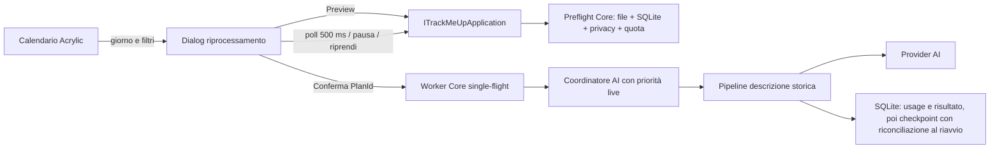

# Proposta tecnica: riprocessamento delle schermate senza descrizione AI

Stato: **proposta da approvare, non implementata**

Data: 15 agosto 2026

## Decisione proposta in breve

Aggiungere al calendario attività un'azione **Riprocessa schermate senza descrizione**. L'azione apre una superficie Acrylic dedicata che, prima di qualsiasi chiamata al provider AI:

1. applica intervallo e filtri;
2. costruisce un piano immutabile e conta esattamente le immagini interessate;
3. mostra in primo piano sia il numero di **schermate** sia il numero di **acquisizioni/richieste AI previste**;
4. richiede una conferma esplicita;
5. avvia nel runtime Core un solo worker in background, interrompibile e riprendibile.

Il worker non deve ciclare direttamente l'attuale `AnalyzeCapturedScreenshotAsync`: quel percorso usa il contesto corrente e mantiene il gate globale delle mutazioni durante la chiamata al provider. Il riprocessamento storico richiede invece un caso d'uso Core dedicato, contesto ricostruito alla data della cattura, checkpoint per elemento e coordinamento con le catture live.

## Stato attuale rilevante

- `ActivityCalendarDialogWindow` è già una finestra Acrylic e legge solo `ITrackMeUpApplication.GetReportAsync(...)`, correttamente senza accesso diretto a SQLite o file.
- `MicaDialogService` serializza le finestre modali con un unico `SemaphoreSlim`; il calendario mantiene quel lock fino alla chiusura.
- `ScreenshotWindow` legge le gallerie tramite `GetScreenshotGalleryAsync` e riceve `AiDescriptionMarkdown` dalla più recente analisi che riferisce il file.
- Le schermate conservate sono la fonte di verità del catalogo; `screenshot_interval_telemetry` associa `artifact_identity`, `capture_id` e ora della cattura.
- `ai_analysis_results.screenshot_paths` contiene più percorsi separati da `;`. Questa forma non permette una query indicizzata per sapere se una singola schermata possiede già una descrizione.
- Un'acquisizione multi-monitor produce più immagini ma una sola analisi AI comune. Perciò “numero di schermate” e “numero di richieste” non sono necessariamente uguali.
- Il limite giornaliero attuale conta le analisi riuscite. Un riprocessamento non deve aggirare né reinterpretare questo guardrail.

## Esperienza utente proposta

### Punto di ingresso nel calendario

Nel pannello del giorno selezionato aggiungere un pulsante testuale con icona:

> **Riprocessa schermate senza descrizione**

Il valore iniziale dell'intervallo è il giorno selezionato. Il comando rimane disponibile anche per un giorno senza attività, perché la presenza di attività aggregata e la presenza di file immagine sono concetti distinti.

Il calendario non deve caricare conteggi di screenshot durante la sua apertura normale. Il preflight parte solo dopo l'azione esplicita, così la vista calendario rimane leggera.

### Transizione modale senza deadlock

La nuova finestra non deve chiamare nuovamente il metodo pubblico di `MicaDialogService` mentre il calendario detiene già `_queue`.

La soluzione consigliata è:

1. `ActivityCalendarDialogWindow.ShowAsync()` restituisce un risultato tipizzato, per esempio `Close` oppure `OpenAiReprocessing` con il giorno selezionato;
2. `MicaDialogService`, mantenendo la stessa sessione modale, chiude il calendario;
3. il servizio apre `AiScreenshotReprocessingDialogWindow` senza riacquisire `_queue`;
4. alla chiusura può terminare oppure riaprire il calendario, decisione da approvare.

In questo modo la finestra principale resta correttamente disabilitata, non nasce una seconda coda modale e non è possibile un'attesa circolare.

### Preflight e conferma

La prima pagina della dialog presenta:

- intervallo inclusivo `Dal` / `Al`;
- scorciatoie `Giorno selezionato`, `Mese visualizzato`, `Intervallo personalizzato`;
- filtro origine `Tutte`, `Manuali`, `Programmate`;
- riepilogo configurazione non segreto: provider AI selezionato e modello;
- quota richieste visive al provider AI: usate, limite giornaliero, disponibili oggi e ora di reset locale;
- stima massima per gli elementi processabili oggi, chiaramente etichettata come stima;
- classificazione esatta dei file trovati.

Esempio di copy, con i numeri come elemento visivo dominante:

> **42 schermate senza descrizione AI**
>
> 28 acquisizioni, quindi al massimo 28 richieste al provider AI
>
> 39 schermate elaborabili · 2 file mancanti · 1 esclusa dalle regole privacy
>
> Quota disponibile oggi: 12 di 20 descrizioni

Il pulsante di avvio deve indicare il perimetro:

> **Avvia per 39 schermate**

Nessuna chiamata al provider parte prima di questa conferma. Se il piano supera la quota disponibile, la dialog deve dichiarare quante acquisizioni possono essere completate oggi e che il resto verrà sospeso, mai suggerire che il limite verrà superato.

### Progresso

Durante l'esecuzione mostrare sempre:

- barra determinata, mai indeterminata dopo la costruzione del piano;
- `completate / totali` e `rimanenti`;
- conteggio parallelo di acquisizioni e schermate;
- elemento corrente: data/ora, origine e numero di monitor, senza mostrare percorsi locali;
- breakdown `riuscite`, `saltate`, `fallite`;
- stato esplicito `In esecuzione`, `Interruzione richiesta`, `In pausa`, `Quota esaurita`, `Completato`;
- pulsante **Interrompi** durante l'esecuzione e **Riprendi** quando in pausa.

Formule invarianti:

```text
acquisizioniCompletate = riuscite + saltate + fallite
acquisizioniRimanenti = acquisizioniTotali - acquisizioniCompletate
schermateCompletate = schermateRiuscite + schermateSaltate + schermateFallite
schermateRimanenti = schermateTotali - schermateCompletate
```

Una acquisizione multi-monitor è un solo work item e una sola richiesta, ma incrementa i contatori schermate del numero reale di immagini associate. La UI non deve usare la parola “schermata” quando sta contando richieste.

### Semantica di interruzione

Per evitare una richiesta accettata dal provider ma non registrata localmente, **Interrompi** è cooperativo al confine tra elementi:

- non vengono avviate nuove richieste;
- l'elemento già inviato termina e viene checkpointato;
- lo stato passa a `paused_by_user`;
- la ripresa continua dal primo elemento ancora pending.

Una cancellazione del token HTTP rimane riservata allo shutdown. Non si può garantire che il provider non addebiti una richiesta già accettata anche se il client la cancella.

## Contratti applicativi proposti

Le view rimangono passive. Raccolgono filtri, renderizzano DTO e invocano esclusivamente `ITrackMeUpApplication`.

### Richieste e DTO

Nomi indicativi, da consolidare in review:

```csharp
public sealed record AiScreenshotReprocessFilter(
    DateOnly From,
    DateOnly To,
    string CaptureOrigin);

public sealed record PreviewAiScreenshotReprocessRequest(
    AiScreenshotReprocessFilter Filter);

public sealed record AiScreenshotReprocessPlan(
    Guid PlanId,
    DateTimeOffset ExpiresAt,
    AiScreenshotReprocessFilter Filter,
    int MissingDescriptionScreenshotCount,
    int MissingDescriptionCaptureCount,
    int EligibleScreenshotCount,
    int EligibleCaptureCount,
    int MissingFileCount,
    int PrivacyBlockedCount,
    int MissingMetadataCount,
    int RemainingDailyAllowance,
    int ProcessableTodayCaptureCount,
    decimal EstimatedMaximumCostTodayUsd,
    string Provider,
    string Model,
    bool CanStart,
    string? BlockingReason);

public sealed record AiScreenshotReprocessJobSnapshot(
    Guid JobId,
    string Status,
    int TotalCaptures,
    int TotalScreenshots,
    int CompletedCaptures,
    int CompletedScreenshots,
    int RemainingCaptures,
    int RemainingScreenshots,
    int SucceededCaptures,
    int SucceededScreenshots,
    int SkippedCaptures,
    int SkippedScreenshots,
    int FailedCaptures,
    int FailedScreenshots,
    AiScreenshotReprocessCurrentItem? CurrentItem,
    string? PauseReason,
    DateTimeOffset UpdatedAt);
```

Il DTO dell'elemento corrente espone solo dati presentabili: progressivo, data/ora, origine, applicazione se autorizzata e numero di schermate. Non espone path, prompt, chiavi o contenuto OCR.

### Metodi della facade

```csharp
Task<OperationResult<AiScreenshotReprocessPlan>>
    PreviewAiScreenshotReprocessingAsync(request, cancellationToken);

Task<OperationResult<AiScreenshotReprocessJobSnapshot>>
    StartAiScreenshotReprocessingAsync(planId, cancellationToken);

Task<OperationResult<AiScreenshotReprocessJobSnapshot>>
    GetAiScreenshotReprocessingJobAsync(jobId, cancellationToken);

Task<OperationResult<AiScreenshotReprocessJobSnapshot>>
    PauseAiScreenshotReprocessingAsync(jobId, cancellationToken);

Task<OperationResult<AiScreenshotReprocessJobSnapshot>>
    ResumeAiScreenshotReprocessingAsync(jobId, cancellationToken);
```

L'avvio ritorna subito dopo avere creato il job; non attende le chiamate al provider. La dialog interroga lo snapshot in memoria con polling limitato, per esempio ogni 500 ms, e interrompe il polling alla chiusura. Il runtime persiste il checkpoint dopo ogni work item.

### Piano congelato

Il preflight produce un `PlanId` runtime-owned, con TTL breve, lista congelata di `capture_id`/`artifact_identity` e fingerprint della configurazione non segreta. Lo start:

- non include automaticamente catture create dopo il preflight;
- rifiuta un piano scaduto;
- rifiuta una modifica di provider, modello o endpoint tra anteprima e conferma;
- ricontrolla file, privacy, descrizione esistente e quota prima di ogni chiamata.

La riclassificazione al momento dell'esecuzione può spostare un elemento da pending a skipped, ma non può aumentare il totale confermato.

## Orchestrazione Core



### Non riutilizzare ciecamente la pipeline corrente

`AnalyzeCapturedScreenshotAsync` oggi:

- verifica il contesto privacy corrente, non quello storico;
- passa `_tracking.LatestAnalysisContext` all'analisi;
- mantiene `MutateAsync` durante OCR, rete e persistenza;
- applica cleanup pensato per una cattura appena creata.

Il nuovo caso d'uso deve invece:

1. risolvere esclusivamente artifact TrackMeUp-owned nella directory configurata;
2. ricostruire il gruppo multi-monitor tramite `capture_id`;
3. ricostruire il contesto storico dai campioni che circondano `captured_utc_ticks` e dalla telemetria persistita;
4. riusare l'OCR già salvato, senza rifare OCR salvo futura opzione esplicita;
5. usare le immagini conservate come input di analisi, accettando che possano contenere il watermark locale perché i raw originali sono già stati eliminati;
6. invocare la logica comune di descrizione con origine stabile `snapshot.reprocess`;
7. persistere usage, risultato e relazione artifact prima del checkpoint; se il runtime termina tra i due commit, il recovery riconcilia l'item `running` come riuscito dalla relazione normalizzata e non ripete la richiesta.

Si consiglia di estrarre dalla pipeline corrente una funzione interna comune che analizzi un `HistoricalScreenshotAnalysisInput`, senza esporre servizi infrastrutturali alla view.

### Single-flight e catture live

Introdurre un coordinatore Core unico per le analisi visive:

- concorrenza massima provider: `1`;
- coda live/manuale ad alta priorità;
- coda di riprocessamento a priorità bassa;
- il batch cede il controllo dopo ogni acquisizione;
- cattura desktop e codifica restano sul worker di cattura esistente, mai sul thread UI;
- nessuna chiamata provider viene eseguita sotto `_mutations`.

Le catture live create mentre il job è attivo non entrano nel piano confermato. La loro analisi ha priorità sul successivo elemento storico. La dialog mostra “In attesa di una cattura live” se il batch è temporaneamente sospeso dal coordinatore.

## Privacy, configurazione, quota e costi

### Privacy e file

Prima del provider, per ogni elemento:

- normalizzare il path e verificare che sia un artifact posseduto da TrackMeUp nella directory configurata;
- verificare esistenza e leggibilità;
- applicare le regole privacy correnti a processo, titolo e contesto storici;
- se il contesto storico necessario non è ricostruibile, saltare in modo fail-closed con `privacy_context_unavailable`;
- non inviare path, nomi finestra o motivi privacy alla UI oltre a categorie localizzate aggregate;
- se un file scompare dopo il preflight, segnare `skipped_file_missing` e continuare.

### Provider AI e configurazione

Il preflight può contare anche quando il provider AI è disabilitato, ma `CanStart` è falso se:

- AI disabilitata;
- chiave provider assente/non plausibile;
- provider, modello o input immagine non validi;
- esiste già un job non terminato incompatibile.

Nessun segreto entra in DTO, SQLite, log o IPC.

### Quota

Ogni work item rivaluta il guardrail subito prima della chiamata. Il worker seriale elimina la corsa tra verifica e incremento del conteggio.

Quando la quota termina:

- non marcare i pending come falliti o saltati;
- passare a `paused_daily_quota`;
- conservare `completati/totali/rimanenti`;
- mostrare il reset alla mezzanotte locale;
- consentire ripresa esplicita dopo il reset; l'eventuale ripresa automatica è una decisione di prodotto separata.

Non deve esistere un pulsante “forza” né un parametro che bypassi `BuildCostGate`. Ogni richiesta visiva al provider AI conta nella stessa quota giornaliera, inclusi i tentativi non riusciti e il perfezionamento OCR tramite AI; i test di connessione sono esclusi.

## Persistenza e query minime

### Relazione normalizzata descrizione-artifact

Per evitare la scansione di tutti i `screenshot_paths` a ogni preflight, aggiungere una relazione indicizzabile:

```sql
CREATE TABLE ai_analysis_artifacts (
    correlation_id TEXT NOT NULL,
    artifact_identity TEXT NOT NULL,
    capture_id TEXT NOT NULL,
    PRIMARY KEY (correlation_id, artifact_identity),
    UNIQUE (artifact_identity),
    FOREIGN KEY (correlation_id)
        REFERENCES ai_analysis_results(correlation_id) ON DELETE CASCADE
);

CREATE INDEX ix_ai_analysis_artifacts_capture
    ON ai_analysis_artifacts(capture_id, artifact_identity);
```

La scrittura avviene nella stessa transazione del risultato riuscito. La migrazione di schema popola la relazione dai `screenshot_paths` dell'attuale formato, in una singola transazione, e fallisce esplicitamente su dati strutturalmente invalidi invece di ignorarli.

Per il range storico aggiungere l'indice:

```sql
CREATE INDEX ix_screenshot_interval_telemetry_captured
    ON screenshot_interval_telemetry(captured_utc_ticks, capture_id, artifact_identity);
```

Il preflight usa una enumerazione filesystem sul worker, deduplica raw/stored per `artifact_identity`, quindi esegue query SQLite batch per telemetria e relazione descrizione. Non costruisce una galleria completa e non esegue una query per file.

### Checkpoint del job

Due tabelle sono sufficienti:

- `ai_reprocess_jobs`: filtro, stato, fingerprint configurazione, totali confermati, timestamp e `active_slot` univoco per impedire due job incompleti;
- `ai_reprocess_job_items`: ordine, `capture_id`, data cattura, numero immagini, identità artifact serializzate nel formato corrente, stato, tentativi e ultimo codice sicuro.

Indici minimi:

```sql
CREATE UNIQUE INDEX ux_ai_reprocess_jobs_active_slot
    ON ai_reprocess_jobs(active_slot);

CREATE INDEX ix_ai_reprocess_job_items_next
    ON ai_reprocess_job_items(job_id, state, ordinal);
```

`active_slot` vale `1` per qualsiasi job incompleto e `NULL` per stati terminali. Ogni descrizione riuscita e il relativo passaggio item a `succeeded` devono essere committati insieme; in caso di crash, al riavvio un item `running` torna `pending` dopo la verifica idempotente.

### Idempotenza

- un solo job incompleto e un solo worker nel runtime proprietario;
- vincolo univoco su `artifact_identity` descritto;
- verifica “descrizione già presente” prima di ogni chiamata;
- `capture_id` originale riusato come correlation id;
- `attempt_id` nuovo per ogni tentativo provider;
- nessun retry applicativo automatico in v1 dopo un errore provider: l'utente decide se riprovare i falliti, così il costo resta leggibile.

## Localizzazione e accessibilità

Tutte le stringhe devono essere presenti in `en`, `it`, `fr`, `de`, `es`, `vi`; nessuna frase hardcoded nel code-behind.

Requisiti minimi:

- tooltip localizzato e `AutomationProperties.Name` identico per ogni pulsante a sola icona;
- titolo della dialog, numero totale e cambio stato annunciati con live region senza annunciare ogni tick;
- progress bar con nome accessibile comprendente completate, totali e rimanenti;
- breakdown non affidato al solo colore;
- focus iniziale sul riepilogo del preflight, poi sul pulsante sicuro **Annulla**;
- Escape durante il job richiede la stessa scelta di pausa prevista dal pulsante di chiusura;
- High Contrast usa risorse di sistema;
- Mica/Acrylic reale, sfondo trasparente e gerarchia senza card decorative annidate.

## API costi OpenAI: perimetro separato e opzionale

Questa integrazione non è necessaria per il riprocessamento e dovrebbe essere una fase distinta, visibile solo quando il provider selezionato è OpenAI.

La documentazione ufficiale espone `GET /v1/organization/costs`, con intervallo temporale, paginazione e raggruppamento per progetto, line item o API key. L'esempio ufficiale usa una **Admin API key** (`OPENAI_ADMIN_KEY`), non la normale chiave usata per le richieste al modello: [OpenAI Costs API](https://developers.openai.com/api/reference/resources/admin/subresources/organization/subresources/usage/methods/costs).

Architettura eventuale:

- servizio vendor-specific `IOpenAiOrganizationCostService`, separato dagli adapter di analisi;
- variabile ambiente amministrativa dedicata e opt-in, mai riuso della normale provider key;
- richiesta limitata al periodo scelto e, se configurato, al project ID di TrackMeUp;
- paginazione completa e cache locale dei soli aggregati monetari con timestamp;
- nessuna chiave, payload amministrativo o risposta grezza persistita nei log;
- UI esplicita: “Spesa OpenAI nel periodo”, non “costo TrackMeUp”, salvo filtro di progetto/API key verificato.

**Saldo disponibile:** nell'attuale documentazione pubblica OpenAI non risulta un endpoint supportato che restituisca il credito residuo/prepagato reale dell'account. Quindi TrackMeUp non deve promettere “balance” o “quanto resta”, né chiamare endpoint dashboard legacy/non documentati. Può mostrare:

- la spesa restituita dal Costs endpoint;
- la quota locale di richieste visive al provider AI rimasta oggi;
- eventualmente il residuo rispetto a un budget locale configurato dall'utente, etichettato come budget TrackMeUp e non come saldo OpenAI.

Un eventuale limite di spesa organizzativo è una soglia di policy, non equivale al credito monetario residuo e non va presentato come balance.

## Test previsti

### Core e persistenza

- conteggio esatto con zero, una e più schermate per acquisizione;
- range inclusivo e conversione corretta giorno locale/UTC nei cambi DST;
- filtri manuale/programmata;
- backfill e vincoli di `ai_analysis_artifacts`;
- una sola query batch, senza N+1, su dataset ampio;
- piano scaduto o configurazione cambiata rifiutati;
- file eliminato dopo preflight saltato senza bloccare il job;
- regola privacy aggiunta dopo preflight rivalutata prima del provider;
- contesto storico mancante fail-closed;
- quota esaurita prima e durante il job;
- checkpoint dopo successo, errore, pausa e crash simulato;
- resume non riprocessa artifact già descritto;
- single-flight e precedenza della cattura live;
- nessun segreto in DTO, SQLite e log.

### Presentazione

- entry point nel calendario e intervallo iniziale sul giorno selezionato;
- nessuna apertura modale annidata sulla stessa coda;
- numero schermate sempre visibile prima della conferma;
- distinzione schermate/acquisizioni/richieste;
- formule dei contatori e progress determinato;
- stato pausa quota e ripresa;
- chiusura/Escape secondo la policy approvata;
- localizzazione completa nei dieci locale supportati;
- tooltip/nome accessibile, live region e High Contrast.

### Integrazione

- runtime IPC: preview, start immediato, polling, pausa e resume;
- una cattura live durante un batch non entra nel piano e viene servita prima del successivo item storico;
- riavvio app con job incompleto e ripresa dal checkpoint;
- provider fake lento/fallito senza bloccare dispatcher, mouse o cattura locale;
- Costs API solo con admin key dedicata e risposta “non configurata” senza fallback alla chiave provider.

## Criteri di accettazione

1. Prima della conferma compare un numero esatto e non ambiguo di schermate; con multi-monitor compare anche il numero di acquisizioni/richieste.
2. Lo start usa esattamente il piano mostrato e non aggiunge nuove catture.
3. Nessun accesso a SQLite, filesystem, ambiente o HTTP risiede in WinUI/code-behind.
4. La UI resta responsiva: nessuna enumerazione file, query, codifica o chiamata provider sul dispatcher.
5. Esiste al massimo una analisi visiva provider in volo e una cattura live ha priorità tra due item storici.
6. `Interrompi` non perde risultati: termina l'item corrente, checkpointa e lascia il resto riprendibile.
7. Dopo crash/riavvio, un job incompleto è rilevato e può essere ripreso senza duplicare descrizioni.
8. File mancanti, privacy, metadati mancanti, AI disabilitata/configurazione invalida e quota hanno esiti distinti e localizzati.
9. Il guardrail giornaliero viene rivalutato per ogni richiesta e non esiste bypass.
10. Il risultato riuscito e la relazione con le schermate sono atomici; un checkpoint interrotto viene riconciliato come riuscito al riavvio, senza una seconda richiesta al provider.
11. La dialog Acrylic rispetta tema, High Contrast, tastiera, screen reader e i dieci locale supportati.
12. Nessuna chiave amministrativa o provider viene salvata, loggata o trasmessa via CLI/IPC diagnostico.

## Rollout proposto

### Fase 1 — Catalogo e preflight, nessuna chiamata AI

- schema normalizzato descrizione-artifact e indice temporale;
- DTO e query Core di preview;
- entry point calendario e dialog con conteggio/conferma disabilitata;
- test di esattezza e performance del preflight.

### Fase 2 — Worker controllato

- tabelle job/item, worker single-flight, stato e checkpoint;
- elaborazione di un solo item per esecuzione pilota;
- pausa/ripresa e progress completo;
- quota, privacy e file missing.

### Fase 3 — Batch e catture live

- coda prioritaria live/batch;
- range ampi, recovery al riavvio e retry manuale dei falliti;
- test di carico con provider fake lento e verifica della responsività.

### Fase 4 — Costi OpenAI opzionali

- integrazione amministrativa separata dietro opt-in;
- sola spesa Costs, senza promessa di saldo residuo;
- revisione sicurezza specifica prima della distribuzione.

## Questioni da approvare prima dell'implementazione

1. **Intervallo predefinito:** giorno selezionato (consigliato) oppure mese visualizzato?
2. **Chiusura durante il job:** pausa cooperativa (consigliata) oppure continuazione in background?
3. **Ritorno al calendario:** riaprirlo automaticamente dopo la dialog oppure tornare alla main window?
4. **Multi-monitor:** mantenere una descrizione comune per acquisizione (consigliato, coerente con oggi) oppure una descrizione separata per ogni monitor, con più richieste e costi?
5. **Errori provider:** nessun retry automatico in v1 (consigliato) oppure un retry per errori sicuramente pre-invio?
6. **Quota esaurita:** sola ripresa manuale dopo mezzanotte (consigliata per v1) oppure ripresa automatica del runtime?
7. **Job falliti:** conservarli fino a pulizia esplicita oppure mantenere soltanto l'ultimo job incompleto e un riepilogo terminale?
8. **Costi OpenAI:** confermare che l'integrazione admin sia una fase separata e non un requisito del riprocessamento.
