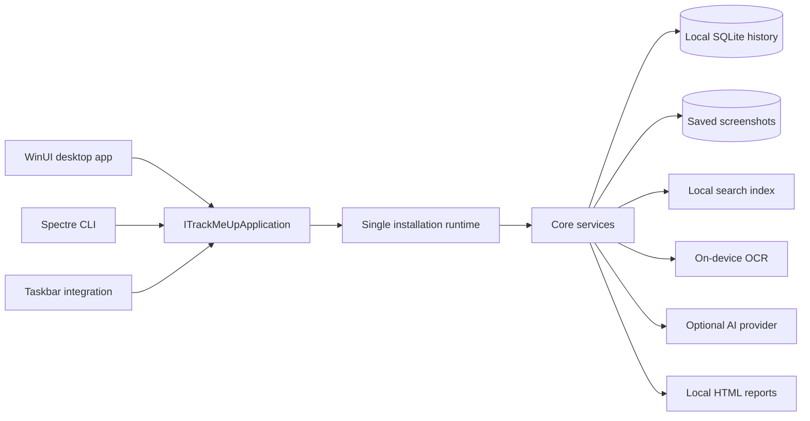

# TrackMeUp architecture

TrackMeUp is a Windows app that stores your history on your PC by default.
Each installation runs one tracker. The desktop app, CLI, taskbar, search,
text recognition (OCR), and reports use the same application services through
`ITrackMeUpApplication`. This keeps their behavior in one place.

## How the pieces fit together

An installation-specific mutex (a Windows lock) decides which process runs the
tracker. Other processes running as the same Windows user connect through a
named pipe using a versioned protocol. The mutex and pipe names use a hash of
the installation ID, so their Windows object names don't expose the ID itself.

## What each project does

| Project | What belongs here |
| --- | --- |
| `TrackMeUp/` | Windows, controls, app startup, and wiring services into the WinUI app. |
| `TrackMeUp.Core/` | Shared app interface and data types, tracker ownership, storage, screenshots, cleanup, reports, Windows and network calls, and translations. |
| `TrackMeUp.Presentation/` | Data and view models used by the UI, without depending on a particular UI framework. |
| `TrackMeUp.Cli/` | Spectre.Console commands and output, using the shared app interface. |
| `TrackMeUp.Taskbar/` | Taskbar features that call Core services. |
| `TrackMeUp.Search/` | The local search index, query checks, text analysis, and results. |
| `TrackMeUp.Ocr/` | Reading text from screenshots with Windows OCR on the PC. |
| `TrackMeUp.Reports.Web/` | Source and reproducible bundled files for local interactive reports. |
| `TrackMeUp.*.Tests/` | Tests for Core, the UI models, CLI, search, and OCR, including checks for previously fixed bugs. |

## Where app behavior belongs

The UI and CLI call `ITrackMeUpApplication` to do work. Views, code-behind,
controls, dialogs, commands, prompts, and renderers collect input and display
data transfer objects (DTOs). They don't access storage, environment variables,
HTTP, capture, cleanup, startup, or Windows APIs directly.

`TrackMeUpApplication` brings the Core services together. It handles changes
one at a time, so the desktop app and CLI can't make conflicting updates through
separate stores or trackers.

### Keeping the implementation manageable

`ITrackMeUpApplication` remains the public way to use app behavior. Internally,
smaller classes handle related pieces of work:

- `WorldClockApplicationService` handles clock queries, city selection rules,
  time-conversion checks, and weather keys. The application facade still
  processes changes one at a time and controls settings writes.
- `RuntimeHost` starts and stops the shared tracker. `RuntimeMutexLease` keeps
  the mutex on the thread that acquired it. `RuntimePipeServer` accepts pipe
  connections from the same Windows user and handles pending requests during
  shutdown. `RuntimeRequestDispatcher` routes versioned protocol requests to
  the application facade.

These classes keep each job small while using the same app interface, tracker,
mutex, named pipe, storage rules, and error behavior.

### Checks that keep this structure in place

`ArchitectureBoundaryContractTests` checks which projects can reference each
other. It also rejects direct storage, network, and other infrastructure work
in WinUI code-behind or Spectre commands and renderers. Runtime catalog tests
check that both the dispatcher and client handle every typed operation.
CI runs .NET analyzers and code-style checks, and treats warnings as errors
in tests and Release builds for every supported architecture.

## How data moves through the app

1. Activity and system services collect the measurements you've enabled, such
   as input counts, without recording the content of keys or clicks.
2. `LocalStore` and `SqliteActivityStore` save settings, activity, analysis,
   and related details on the PC.
3. `ScreenshotStorageLayout` organizes screenshots in folders using
   `yyyy-MM/week-YYYY-WW/yyyy-MM-dd`.
4. OCR and local search work without an AI provider.
5. AI requests are built only for enabled features, with keys read from
   environment variables.
6. Reports use saved local data and the web files included with the app.

See the [privacy guide](PRIVACY.md) for what is saved and what can leave the PC.

## Handling errors and sensitive operations

- Report invalid input, unsupported states, missing required settings, and
  storage or Windows API failures clearly.
- Ask for confirmation before destructive actions. Check that every target
  path belongs to TrackMeUp.
- Secrets never travel through CLI arguments, settings, history, IPC
  diagnostics, or test snapshots.
- Don't start another tracker if the UI fails.
- Don't silently turn an optional feature into a required fallback.

## Adding a feature

1. Add or update the DTOs and methods in `ITrackMeUpApplication`.
2. Put behavior and I/O in a Core application or infrastructure service.
3. Keep WinUI and CLI code limited to input and display, and localize visible text.
4. Add focused tests for the Core or presentation contracts you changed.
5. Explain any effects on privacy, accessibility, error handling, or migration.
6. Record the licenses and sources of any new third-party code or assets.

Start with the [contributor guide](../CONTRIBUTING.md) and use the
[manual checks](VALIDATION.md) to check how the change looks and behaves.
