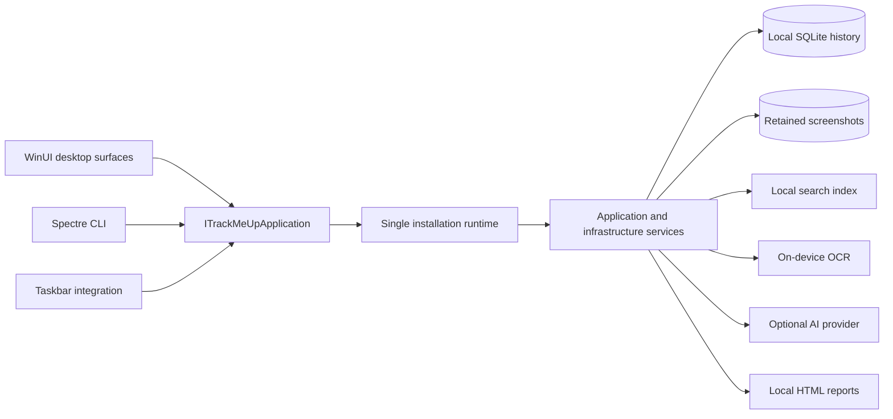

# TrackMeUp architecture

TrackMeUp is a Windows-first, local-first application with one application
facade and one tracking runtime per installation. Desktop, CLI, taskbar, search,
OCR, and reporting features share those boundaries instead of creating
parallel implementations.

## System view

The process that acquires the installation-scoped mutex owns the runtime. Other
same-user processes connect through the versioned named-pipe protocol. Endpoint
names are derived from a hash of the installation identifier so the raw
identifier is not exposed through Windows kernel-object names.

## Project responsibilities

| Project | Responsibility |
| --- | --- |
| `TrackMeUp/` | WinUI composition root, windows, controls, native presentation, and application startup. |
| `TrackMeUp.Core/` | Application facade, contracts, runtime ownership, persistence, capture, retention, reporting, OS interop, network adapters, and localization. |
| `TrackMeUp.Presentation/` | UI-neutral projections and view models consumed by presentation surfaces. |
| `TrackMeUp.Cli/` | Spectre.Console commands and rendering over the shared application facade. |
| `TrackMeUp.Taskbar/` | Taskbar integration over Core services. |
| `TrackMeUp.Search/` | Local indexing, query validation, analyzers, and result retrieval. |
| `TrackMeUp.Ocr/` | Windows on-device screenshot OCR boundary. |
| `TrackMeUp.Reports.Web/` | Source and deterministic distribution for local interactive reports. |
| `TrackMeUp.*.Tests/` | Core, presentation, CLI, search, and OCR contracts and regression coverage. |

## Application boundary

`ITrackMeUpApplication` is the product behavior boundary. WinUI views,
code-behind, controls, dialogs, Spectre commands, prompts, and renderers may
collect input, bind or render DTOs, and invoke the facade. They do not directly
own persistence, environment access, HTTP, capture, retention, startup, or OS
interop.

The concrete `TrackMeUpApplication` composes Core services. Mutations are
serialized in the application layer so the desktop and CLI cannot race separate
stores or trackers.

## Local data flow

1. Activity and system services collect the enabled non-content signals.
2. `LocalStore` and `SqliteActivityStore` persist settings, activity, analysis,
   and metadata locally.
3. Screenshot artifacts use the explicit
   `yyyy-MM/week-YYYY-WW/yyyy-MM-dd` hierarchy owned by
   `ScreenshotStorageLayout`.
4. On-device OCR and local search remain usable without an AI provider.
5. Optional AI-provider requests are built only for enabled features and use
   the environment-variable secret flow.
6. Reports are generated locally from the retained data and bundled web assets.

See [Privacy and data flow](PRIVACY.md) for the user-facing data inventory and
transmission boundaries.

## Failure and safety model

- Invalid input, unsupported states, missing required configuration, and
  persistence or interop failures fail explicitly.
- Destructive data operations require deliberate confirmation and target only
  validated TrackMeUp-owned paths.
- Secrets never travel through CLI arguments, settings, history, IPC
  diagnostics, or test snapshots.
- Presentation failures do not create an alternative tracking runtime.
- Optional features do not silently become mandatory fallbacks.

## Adding a feature

1. Define or extend DTOs and the `ITrackMeUpApplication` contract.
2. Implement behavior and I/O behind a Core application or infrastructure service.
3. Keep WinUI and CLI changes passive and localized.
4. Add focused Core or presentation contract tests.
5. Document privacy, accessibility, failure, and migration implications.
6. Update third-party notices or asset provenance when new material is introduced.

Start with [CONTRIBUTING.md](../CONTRIBUTING.md) and validate visible behavior
against the [manual validation guide](VALIDATION.md).
