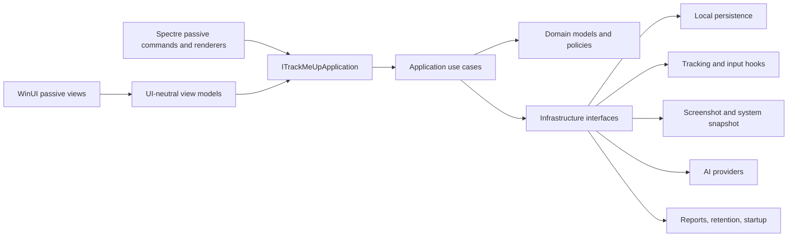

# TrackMeUp CLI and shared application notes

This is an internal engineering document for the CLI and shared application surface. The product description and the plain-language privacy/dependency census live in [README.md](../README.md) and [docs/PRIVACY.md](PRIVACY.md).

Status: active product architecture notes. TrackMeUp is a working internal product, not an MVP; this document records the engineering work that keeps the desktop app and CLI consistent.

Date: 2026-08-05

Target runtime: .NET 10 on Windows 10/11, x64 and ARM64. The existing x86 target remains supported where the project and package pipeline allow it.

Supported shell: PowerShell 7 (`pwsh`) only. Windows PowerShell 5.1, `cmd.exe`, Bash, WSL, and other shells are outside the support contract.

## 1. Objective

Add a rich, localized command-line frontend to TrackMeUp. Running `trackmeup -cli` must open an interactive, colorful Spectre.Console experience with UTF-8 text, emoji, responsive live views, and purposeful animations. Running `trackmeup -cli <command>` must execute one command non-interactively.

The CLI and WinUI application must expose the same application capabilities through shared services and UI-independent data models. Neither frontend may own business logic.

## 2. Non-negotiable architecture rules

1. WinUI windows, dialogs, flyouts, controls, and code-behind are passive views.
2. Spectre.Console commands, prompts, and renderers are passive CLI views.
3. All behavior must pass through application services and UI-independent models.
4. No view may instantiate `LocalStore`, tracking, screenshot, AI, report, retention, startup, registry, environment-variable, HTTP, or native interop services.
5. No view may call `File`, `Directory`, `Process`, `Environment`, registry APIs, HTTP clients, screen capture APIs, input hooks, WMI, or performance counters.
6. Views may format presentation-only text, select a widget, bind state, collect user input, and invoke an application command.
7. Business validation belongs in application services. Presentation validation may only provide immediate usability feedback and must not be the only validation.
8. UI and CLI must consume the same result DTOs. Do not create CLI-specific copies of domain models.
9. API keys must never be stored in `appsettings.json`, command history, logs, IPC payload logs, or command-line arguments.
10. Public and protected C# members require XML documentation. Critical I/O, IPC, native interop, privacy, and external-service paths require concise implementation comments.
11. Code, identifiers, internal prompts, tests, and developer documentation are English. User-facing content is localizable in English, Italian, Vietnamese, French, German, and Spanish.
12. Every x64 and ARM64 build must finish with zero warnings and zero errors.

## 3. Current-state observations

The current solution is a single WinUI executable targeting `net10.0-windows10.0.19041.0`.

`App.OnLaunched` always creates `MainWindow`.

`MainWindow` currently constructs `LocalStore`, `OpenAiAnalysisService`, `TrackingDomainService`, `StartupService`, and related concrete services. Some settings mutations, folder operations, automatic-analysis orchestration, and startup handling are still initiated directly from the window or options control.

The domain and persistence types are already mostly UI-independent. Existing reusable capabilities include:

- Tracking start, stop, dashboard state, elapsed time, latest activity context, and last session.
- Input and foreground-application sampling.
- Rich context providers for Office, Adobe, IDEs, browsers, compilers, and generic applications.
- System snapshots for CPU, GPU, memory, network, and disks.
- Per-monitor or active-window screenshots, WebP encoding through SkiaSharp, optional local retention, and local watermarking.
- AI analysis through OpenAI, OpenRouter, and Anthropic decoders.
- HTML report generation.
- Settings, environment-variable API-key lookup, local JSONL history, startup registration, localization, and installation identity.

The data model already includes focus-session, retention, digest, privacy, plugin, and cost-guardrail fields. Not every capability currently has a complete application-service entry point. The implementation must finish those entry points before exposing the matching CLI command.

## 4. Dependency versions

Use stable versions only and pin exact versions. At design time, the NuGet stable feed reports:

| Package | Version | Project |
| --- | ---: | --- |
| `Spectre.Console` | `0.57.2` | `TrackMeUp.Cli` |
| `Spectre.Console.Cli` | `0.55.0` | `TrackMeUp.Cli` |
| `Spectre.Console.Testing` | `0.57.2` | `TrackMeUp.Cli.Tests` |
| `Microsoft.Extensions.DependencyInjection` | `10.0.10` | composition roots |

`Spectre.Console.Cli 0.55.0` accepts `Spectre.Console >= 0.55.0`, so the direct `0.57.2` reference is intentional. Restore must not produce package-downgrade warnings.

Implementation verification on 2026-08-05: `dotnet list .\TrackMeUp.slnx package --outdated` reported no newer stable packages from the configured feeds before CLI package integration. The implementation pins `Spectre.Console` 0.57.2, `Spectre.Console.Cli` 0.55.0, `Spectre.Console.Testing` 0.57.2, and `Microsoft.Extensions.DependencyInjection` 10.0.10.

Before implementation, run the repository's standard outdated-package check once. Change the pinned versions only if newer stable versions are then available, and record the selected versions in this document and the pull request.

Do not add ImageSharp directly or transitively.

## 5. Target solution structure

```text
TrackMeUp.sln
├── TrackMeUp/                         WinUI views and Windows composition root
├── TrackMeUp.Core/                    Domain, application, infrastructure contracts
│   ├── Domain/
│   ├── Application/
│   ├── Infrastructure/
│   ├── Runtime/
│   └── Localization/
├── TrackMeUp.Presentation/            UI-neutral view models and presentation state
├── TrackMeUp.Cli/                     Spectre.Console frontend and console composition root
├── TrackMeUp.Core.Tests/
├── TrackMeUp.Presentation.Tests/
├── TrackMeUp.Cli.Tests/
└── scripts/
    └── TrackMeUp.ps1
```

Keep the existing `TrackMeUp` namespace where practical to minimize migration risk. New namespaces should follow folder responsibility, for example `TrackMeUp.Application`, `TrackMeUp.Runtime.Ipc`, and `TrackMeUp.Cli.Rendering`.



## 6. Shared application facade

Create `ITrackMeUpApplication` as the single frontend entry point. It must expose task-based methods even when the current implementation is synchronous. This prevents future I/O and IPC changes from leaking into views.

Required operation groups:

| Group | Required operations |
| --- | --- |
| Runtime | health, version, installation identity, capabilities |
| Tracking | start, pause, toggle, current dashboard, watch state |
| Sessions | last session, today's summary, recent activity |
| Focus | start with objective, status, stop, optional AI summary |
| System | capture current CPU/GPU/memory/network/disk snapshot |
| Screenshots | capture, latest, storage path, open storage folder |
| AI | status, configure non-secret settings, analyze now, cost gate |
| Reports | generate today, generate daily digest, open report folder |
| Privacy | list, add, remove, test current window against rules |
| Retention | status, preview deletion, execute deletion |
| Plugins | list, inspect, enable, disable |
| Settings | read typed settings, patch allowed fields, validate, save |
| Startup | status, enable, disable |
| Links | about data, repository URL, author URL, contact URL |

Every mutating operation returns an `OperationResult<T>` containing:

```csharp
public sealed record OperationResult<T>(
    bool Succeeded,
    string Code,
    string MessageKey,
    T? Value,
    IReadOnlyList<ValidationIssue> Issues);
```

`MessageKey` is localizable. `Code` is stable, English, and suitable for JSON/automation. Never make CLI logic depend on translated text.

Create explicit request DTOs such as `StartTrackingRequest`, `CaptureScreenshotRequest`, `AnalyzeCurrentActivityRequest`, `SettingsPatch`, `RetentionRequest`, and `StartFocusSessionRequest`. Do not pass control instances, Spectre settings objects, or XAML types into the application layer.

## 7. Passive WinUI design

Create UI-neutral view models in `TrackMeUp.Presentation`:

| View model | Responsibility |
| --- | --- |
| `MainViewModel` | Player state, start/pause command, details state, last session |
| `OptionsViewModel` | Editable settings snapshot, validation, save command |
| `AiConfigurationViewModel` | Provider/model/endpoint/key-variable status and secret-set command |
| `AboutViewModel` | Version, author, links, license, close command |
| `FocusSessionViewModel` | Objective, active state, elapsed state, finish command |
| `PrivacyViewModel` | Privacy rule list and edit commands |
| `ReportViewModel` | Generate/open report commands and progress state |

Code-behind acceptance rule: event handlers must be absent where binding supports the interaction. If a WinUI event cannot be bound cleanly, the handler may only forward arguments to a view-model command and must contain no branching, I/O, service construction, or state mutation.

Dialogs receive immutable presentation models and return a typed user decision. Dialogs do not call services. The calling view model passes the confirmed request to `ITrackMeUpApplication`.

`App.xaml.cs` is a composition root only. It may parse launch mode, construct dependency injection, activate the runtime host, and create a window. It must not implement business rules.

## 8. Runtime ownership and IPC

Only one runtime may own input hooks, activity sampling, settings writes, retention, and snapshot analysis for an installation.

Use a per-installation named mutex and a same-user named pipe. Derive names from a SHA-256 hash of the installation ID; do not put the raw machine name or full installation ID in kernel object names.

Recommended names:

```text
Local\TrackMeUp.Runtime.<installation-hash>
TrackMeUp.Runtime.<installation-hash>
```

Use `NamedPipeServerStream` with current-user-only access. The pipe protocol must be versioned and length-prefixed JSON.

Request envelope:

```json
{
  "protocolVersion": 1,
  "requestId": "guid",
  "operation": "tracking.start",
  "payload": {},
  "locale": "it",
  "clientVersion": "1.0.0"
}
```

Response envelope:

```json
{
  "protocolVersion": 1,
  "requestId": "guid",
  "succeeded": true,
  "code": "tracking.started",
  "messageKey": "TrackingStarted",
  "payload": {},
  "issues": []
}
```

The runtime host is the sole writer to `appsettings.json` and JSONL history. Serialize mutating operations through one `SemaphoreSlim` inside the application layer.

When the UI is running, it owns the runtime and serves the pipe. When the CLI starts and no runtime is available, it launches `TrackMeUp.exe --background`, waits up to five seconds for the pipe, then executes the requested command. The background host remains alive after a one-shot CLI command so tracking can continue.

When the runtime changes tracking state from UI, CLI, automatic startup, or another local control path, it publishes one state event. The WinUI toast and interactive CLI live view consume that same event.

Do not implement two independent `TrackingDomainService` instances.

## 9. Launch modes and bootstrap switches

Add a launch parser that runs before any window is created.

| Switch | Behavior |
| --- | --- |
| no switch | Start the WinUI player and runtime host |
| `--ui` | Explicitly start/show the WinUI player |
| `-cli`, `--cli` | Start the CLI frontend |
| `--background` | Internal runtime-host mode with no visible window |
| `--start-tracking` | Ask the runtime to start after launch |
| `--paused` | Override automatic start for this launch |
| `--language <code>` | Session-only locale override |
| `--theme <system|light|dark>` | Session-only UI override |
| `--position <value>` | Session-only flyout position override |
| `--safe-mode` | Disable hooks, screenshots, automatic AI, and startup mutations |
| `--no-splash` | Suppress the 30-second informational toast for this launch |
| `-h`, `--help` | Show launch help without opening a window |
| `--version` | Print product and protocol versions |

Strip `-cli` or `--cli` before passing remaining arguments to `Spectre.Console.Cli`.

Recommended packaged invocation:

```powershell
trackmeup.exe -cli
trackmeup.exe -cli status
trackmeup.exe -cli tracking start
```

Add a Microsoft Store app execution alias for `trackmeup.exe`. The alias must target the CLI-capable executable included in the MSIX package.

## 10. PowerShell 7 and UTF-8 contract

The supported launch path is PowerShell 7 through `pwsh`. Documentation and scripts must always use `pwsh -NoProfile`.

At CLI startup:

1. Attach to the parent console when required by the Windows GUI subsystem.
2. Set the Windows input and output code pages to UTF-8 (`65001`).
3. Set `Console.InputEncoding` and `Console.OutputEncoding` to UTF-8 without BOM.
4. Detect redirected input/output/error.
5. Disable animations, live refresh, and ANSI color automatically when output is redirected.
6. Handle `Console.CancelKeyPress` and propagate a cancellation token.
7. Treat a parent process other than `pwsh.exe` as unsupported. Show one warning in rich mode, but do not add compatibility workarounds for Windows PowerShell 5.1 or `cmd.exe`.

Do not use fixed sleeps to simulate animation. Spinners and progress must reflect real work.

## 11. CLI global options

| Option | Meaning |
| --- | --- |
| `--format <rich|plain|json>` | Output contract; default is `rich` on a terminal and `plain` when redirected |
| `--json` | Alias for `--format json` |
| `--language <en|it|vi|fr|de|es>` | Output locale for this invocation |
| `--no-color` | Disable ANSI color |
| `--no-emoji` | Replace emoji with text-safe symbols |
| `--no-animation` | Disable spinner/live animation |
| `--quiet` | Print only final result or error |
| `--yes` | Confirm eligible destructive operations non-interactively |
| `--timeout <seconds>` | IPC/external-operation timeout |
| `--verbose` | Add diagnostic context without secrets or screenshot content |

JSON mode writes exactly one valid JSON document to stdout. Diagnostics go to stderr. JSON output contains no ANSI sequences, localized field names, progress frames, or emoji.

## 12. Command hierarchy

The first command token accepts an optional leading slash in both one-shot and interactive modes. For example, `status`, `/status`, `tracking pause`, and `/tracking pause` use the same router. General help is available as `/help`; command help is available as `/help /command`, `/command help`, or `/command --help`. Help and version requests are resolved before runtime startup.

```text
trackmeup -cli
trackmeup -cli /help [/command]
trackmeup -cli /version
trackmeup -cli status [--watch] [--interval <seconds>]
trackmeup -cli runtime health
trackmeup -cli tracking start [--safe-mode]
trackmeup -cli tracking pause
trackmeup -cli tracking toggle
trackmeup -cli session last
trackmeup -cli session today
trackmeup -cli focus start --objective <text>
trackmeup -cli focus status
trackmeup -cli focus stop [--summarize]
trackmeup -cli system snapshot [--watch]
trackmeup -cli screenshot capture [--mode <all-screens|active-window>] [--keep] [--watermark]
trackmeup -cli screenshot latest
trackmeup -cli screenshot open-folder
trackmeup -cli ai status
trackmeup -cli ai analyze [--no-capture]
trackmeup -cli ai enable
trackmeup -cli ai disable
trackmeup -cli ai configure
trackmeup -cli ai key set
trackmeup -cli report today [--open] [--output <directory>]
trackmeup -cli report digest [--date <yyyy-MM-dd>] [--open]
trackmeup -cli privacy list
trackmeup -cli privacy add --type <process|title|hint> --value <text>
trackmeup -cli privacy remove --id <id>
trackmeup -cli privacy test-current
trackmeup -cli retention status
trackmeup -cli retention preview
trackmeup -cli retention run [--yes]
trackmeup -cli plugins list
trackmeup -cli plugins show <id>
trackmeup -cli plugins enable <id>
trackmeup -cli plugins disable <id>
trackmeup -cli config list
trackmeup -cli config get <key>
trackmeup -cli config set <key> <value>
trackmeup -cli config wizard
trackmeup -cli settings ...                 # alias of config
trackmeup -cli startup status
trackmeup -cli startup enable
trackmeup -cli startup disable
trackmeup -cli open ui
trackmeup -cli open reports
trackmeup -cli open screenshots
trackmeup -cli about
trackmeup -cli doctor
trackmeup -cli diagnostics                  # alias of doctor
```

Command names and option names remain English in every locale. Descriptions, prompts, messages, and table headings are localized.

`ai key set` must use a secret prompt. Do not support `--key <value>` because command lines are visible in PowerShell history and process inspection.

`config list`, `config get`, and `config set` use stable public keys from the shared settings catalog; they never use reflection over `AppSettings`. The output excludes installation identity, privacy-rule storage, history markers, API-key values, accumulated cost state, and other internal fields. The non-secret API-key variable name and configurable cost estimates remain visible. `config set` forwards the selected public key to the application facade, where the authoritative typed validation and persistence rules remain enforced.

## 13. UI-to-CLI capability mapping

| Existing or planned UI action | CLI equivalent | Shared application operation |
| --- | --- | --- |
| Play/pause player | `tracking start`, `tracking pause`, `tracking toggle` | tracking use case |
| Player counters and context | `status`, `status --watch` | dashboard query |
| Runtime and capability health | `runtime health`, `doctor` | runtime/diagnostics query |
| Details chevron | `session last`, `plugins show` | last-session/context query |
| Screenshot preview/folder | `screenshot latest`, `screenshot open-folder` | screenshot query/link service |
| Screenshot toggle | `config set screenshots.enabled true|false` | settings patch |
| OpenAI toggle | `ai enable`, `ai disable` | AI settings use case |
| OpenAI configuration | `ai configure`, `ai key set` | AI configuration use case |
| Options save | `config set`, `config wizard` | settings validation/save |
| Options inspect | `config list`, `config get` | typed settings query and shared public-key catalog |
| Start with Windows | `startup enable`, `startup disable` | startup use case |
| Generate report | `report today`, `report digest` | report use case |
| Focus objective/session | `focus start`, `focus status`, `focus stop` | focus use case |
| Privacy zones | `privacy ...` | privacy-rule use case |
| Retention | `retention ...` | retention use case |
| Detailed app providers | `plugins ...` | plugin registry use case |
| About box and links | `about`, `open ...` | product-information query |

### 13.1 Current parity audit

The CLI now routes every operation currently exposed by `ITrackMeUpApplication`: runtime health; tracking and dashboard; session and focus state; system snapshot; screenshots; AI; reports; privacy; retention; plugins; public settings; startup; and product information. All current WinUI mutations and queries therefore have a CLI equivalent. Slash-prefixed and conventional command forms reach the same dispatcher and the same facade calls.

Strict bidirectional feature parity is not yet complete because the current WinUI surface does not provide controls for several facade capabilities already available in the CLI: focus sessions, privacy-rule management, retention preview/run, plugin management, system snapshots, manual AI analysis, and dated digest generation. These are WinUI presentation gaps; duplicating their behavior in CLI presentation code is not an acceptable workaround.

One existing architecture exception also remains outside the command facade: `open ui` activates a process directly, and runtime connection/startup is owned by the CLI bootstrap. Moving those paths behind a Core runtime coordinator or an explicit activation operation is required before the CLI presentation layer is fully passive.

`doctor` performs a read-only sweep of runtime health, redacted observability state, dashboard reachability, AI status, retention policy, startup registration, and plugins. The runtime DTO reports console/file logging availability, Sentry state, and the default-PII flag without exposing the DSN, log path, installation identifier, environment values, or secret material. The CLI never inspects environment variables or log files directly.

## 14. Spectre.Console widget design

Use the widget set deliberately. A renderer receives DTOs and returns Spectre renderables; it never fetches data or changes state.

| Widget | TrackMeUp use |
| --- | --- |
| `Panel` | Branded header, runtime warnings, latest-session card, AI result |
| `Table` | Current status, top applications, settings, plugins, privacy rules, disk state |
| `BarChart` | Active time by application and CPU/GPU/memory percentages |
| `BreakdownChart` | Active, idle, and paused time distribution |
| `Calendar` | Days with captured activity and generated daily digests |
| `Tree` | Application → document/tab/context → provider attributes; diagnostics hierarchy |
| `Progress` | Report generation, retention cleanup, multi-monitor screenshot processing |
| `Status` and spinners | Runtime startup, AI analysis, health checks, one-off snapshots |
| `SelectionPrompt` | Main interactive menu, provider selection, theme/language selection |
| `MultiSelectionPrompt` | Plugin and privacy-rule batch configuration |
| `TextPrompt` | Focus objective, paths, numeric limits, secret API-key input |
| `Live` | Tracking dashboard and system snapshot watch modes |
| `Rule`, `Markup`, `FigletText` | Branded sectioning and startup identity |

Brand palette:

| Token | Suggested color |
| --- | --- |
| Primary | coral/red matching the TrackMeUp graph |
| Secondary | cyan/teal matching the icon border |
| Background-safe accent | steel blue |
| Success | soft green |
| Warning | amber |
| Error | coral red |
| Muted | grey70 |

Do not hardcode markup around unescaped user data. Always call `Markup.Escape` for window titles, application names, paths, objectives, model output, and provider attributes.

## 15. Interactive shell experience

`trackmeup -cli` with no command opens a persistent shell.

Initial layout:

```text
╭────────────────────────────────────────────────────────────╮
│  TrackMeUp  ● RUNNING                              01:42:18 │
│  VS Code · TrackMeUp · CLI_IMPLEMENTATION_PLAN.md           │
╰────────────────────────────────────────────────────────────╯

  ⌨  1,842 keys     🖱  391 clicks     ⚡ 74% intensity
  CPU 18% · GPU 7% · RAM 15.5/31.9 GB · ↓ 1.4 MB/s ↑ 92 KB/s

  [1] Status       [2] Start/Pause     [3] Focus
  [4] Analyze      [5] Report          [6] Screenshots
  [7] Privacy      [8] Settings        [9] Diagnostics

  trackmeup> _
```

Interactive commands may be entered as normal command text or selected from prompts. Support `help`, `clear`, `status`, `exit`, and the same nested commands as one-shot mode. Do not build a second command parser for the REPL. Tokenize the line, then invoke the same Spectre command app used by one-shot mode.

Do not persist interactive command history in the MVP. This avoids retaining focus objectives, document names, paths, or accidental secrets.

The startup animation lasts at most 700 ms and is skipped with `--no-animation`, redirected output, JSON mode, or reduced-motion configuration. Long operations use real progress. No artificial waiting is allowed.

## 16. Privacy and security requirements

1. Apply privacy rules before screenshot capture and before AI analysis, not only before rendering output.
2. Never send a screenshot when screenshots or AI analysis are disabled.
3. Preserve the current separation: transient raw captures may be provided to the configured AI provider only after authorization; retained local copies are watermarked when enabled.
4. Delete transient captures after analysis when retention is disabled, including failure and cancellation paths.
5. Never log screenshot bytes, API keys, full AI request bodies, or unredacted IPC payloads.
6. Redact window titles and document names in diagnostics unless `--verbose` is explicitly selected and privacy rules allow them.
7. Use same-user pipe security and reject protocol/client versions that are not compatible.
8. Require confirmation for retention deletion and bulk privacy/plugin changes. `--yes` is valid only for commands that explicitly document non-interactive confirmation.
9. Store API keys only in the configured user environment variable. Secret prompts must hide input and clear temporary strings as far as practical.
10. Escape all Spectre markup from external or user-controlled values.

## 17. Persistence and settings

The runtime host is the sole persistence writer.

Make settings writes atomic: serialize to a temporary file in the same directory, flush it, then replace the previous file. Recover from malformed settings by preserving the invalid file with a timestamped `.corrupt` suffix and loading defaults; do not silently overwrite it.

Keep user settings in the existing local `appsettings.json`. Do not store CLI presentation state in it. If future CLI state becomes necessary, use a separate schema-versioned `cli-state.json` with no secrets and atomic writes.

All stored records and IPC result DTOs retain the installation ID so report aggregation across workstations remains possible.

## 18. Exit codes

| Code | Meaning |
| ---: | --- |
| `0` | Success |
| `2` | Invalid command or arguments |
| `3` | Validation failed |
| `4` | Runtime host unavailable |
| `5` | Operation blocked by privacy policy |
| `6` | AI disabled or API key missing |
| `7` | Cost guardrail rejected analysis |
| `8` | External provider or OS integration failure |
| `9` | IPC protocol mismatch |
| `10` | Partial success |
| `130` | Cancelled with Ctrl+C |

Commands must map application result codes to exit codes in one centralized `ExitCodeMapper`.

## 19. File-by-file implementation map

Create:

| Path | Purpose |
| --- | --- |
| `TrackMeUp.Core/TrackMeUp.Core.csproj` | Shared .NET 10 Windows class library |
| `TrackMeUp.Core/Application/ITrackMeUpApplication.cs` | Frontend facade |
| `TrackMeUp.Core/Application/TrackMeUpApplication.cs` | Use-case orchestration |
| `TrackMeUp.Core/Application/OperationResult.cs` | Stable operation results |
| `TrackMeUp.Core/Application/Requests/*.cs` | Typed operation requests |
| `TrackMeUp.Core/Application/Ports/*.cs` | Infrastructure interfaces |
| `TrackMeUp.Core/Runtime/TrackMeUpRuntimeHost.cs` | Single runtime owner |
| `TrackMeUp.Core/Runtime/Ipc/*.cs` | Versioned named-pipe protocol/client/server |
| `TrackMeUp.Presentation/*.cs` | UI-neutral view models |
| `TrackMeUp.Cli/TrackMeUp.Cli.csproj` | Console frontend |
| `TrackMeUp.Cli/Program.cs` | CLI composition root only |
| `TrackMeUp.Cli/Bootstrap/CliHost.cs` | UTF-8, PowerShell 7, cancellation, output profile |
| `TrackMeUp.Cli/Commands/**/*.cs` | Typed Spectre commands/settings |
| `TrackMeUp.Cli/Rendering/*.cs` | DTO-to-widget renderers |
| `TrackMeUp.Cli/Interactive/*.cs` | Persistent shell using the same command app |
| `TrackMeUp.Cli/Localization/*.cs` | CLI localization adapter |
| `TrackMeUp.Core.Tests/*` | Domain/application/runtime tests |
| `TrackMeUp.Presentation.Tests/*` | View-model tests |
| `TrackMeUp.Cli.Tests/*` | Parser, renderer, console, and IPC tests |
| `scripts/TrackMeUp.ps1` | Supported-shell smoke tests and repository automation entrypoint |

Modify:

| Path | Required change |
| --- | --- |
| `TrackMeUp/TrackMeUp.csproj` | Reference Core/Presentation; remove moved infrastructure packages; include packaged CLI executable |
| `TrackMeUp/App.xaml.cs` | Launch parsing, DI composition, runtime/UI activation only |
| `TrackMeUp/MainWindow.xaml` | Bind to `MainViewModel` |
| `TrackMeUp/MainWindow.xaml.cs` | Remove concrete services and business logic |
| `TrackMeUp/Controls/OptionsControl.xaml` | Bind to `OptionsViewModel` |
| `TrackMeUp/Controls/OptionsControl.xaml.cs` | Remove persistence, environment, report, and startup calls |
| `TrackMeUp/AboutWindow.xaml` | Bind to `AboutViewModel` |
| `TrackMeUp/AboutWindow.xaml.cs` | Close/activation forwarding only |
| `TrackMeUp/Package.appxmanifest` | Add app execution alias and packaged CLI executable |
| `README.md` | CLI usage, privacy, shell support, screenshots, examples |
| `AGENTS.md` | Reinforce passive-view and service/model rules |
| `.github/copilot-instructions.md` | Mirror the same architecture and XML-comment rules |

Move existing UI-independent models, providers, and services into `TrackMeUp.Core`. Preserve history file formats and namespaces unless a migration test proves compatibility.

## 20. Implementation phases

### Phase 1: Baseline and project split

Create the solution projects, move UI-independent code, add project references, and keep behavior unchanged.

Acceptance: WinUI x64 and ARM64 builds pass with zero warnings; existing settings/history remain readable; no CLI yet.

### Phase 2: Application facade and ports

Introduce `ITrackMeUpApplication`, typed requests/results, infrastructure interfaces, and application use cases. Route existing UI behavior through the facade.

Acceptance: `MainWindow`, options control, and About window contain no concrete infrastructure creation or I/O; view-model tests cover UI actions.

### Phase 3: Runtime host and single-instance IPC

Implement the mutex, named pipe, protocol, background-host activation, operation serialization, and event publication.

Acceptance: UI and a test client control one runtime; a second tracker cannot start; concurrent settings writes cannot occur.

### Phase 4: CLI bootstrap

Add Spectre packages, PowerShell 7 detection, UTF-8 setup, global options, DI integration, cancellation, output modes, and core help/version commands.

Acceptance: `trackmeup -cli --help`, `--version`, rich, plain, and JSON modes work without opening XAML.

### Phase 5: Read-only commands and widgets

Implement status, session, system snapshot, plugins list/show, config list/get, about, and doctor. Add Panel, Table, Tree, BarChart, BreakdownChart, and Live renderers.

Acceptance: renderers are deterministic under `Spectre.Console.Testing`; JSON is valid and ANSI-free.

### Phase 6: Tracking and focus commands

Implement tracking and focus mutations through IPC. Publish state-change events to both frontends.

Acceptance: starting or pausing from CLI updates the open UI and its status toast; tracking persists after one-shot CLI exit through the background host.

### Phase 7: Settings, startup, privacy, and plugins

Implement typed settings patches, interactive wizard, startup control, privacy rules, plugin enablement, validation, confirmation, and atomic persistence.

Acceptance: invalid settings are rejected consistently by UI and CLI; no secret enters settings or history.

### Phase 8: Screenshots and AI

Implement screenshot capture/latest/folder and AI status/configure/analyze/key commands. Apply privacy, cost, retention, and cancellation policies in the application layer.

Acceptance: disabled screenshots create no file; transient AI screenshots are cleaned; retained copies follow watermark policy; API keys never appear in output or logs.

### Phase 9: Reports, retention, digest, and calendar

Implement report and retention commands, real progress reporting, and activity-calendar rendering.

Acceptance: retention preview is read-only; retention run requires confirmation; report output matches the UI-generated report contract.

### Phase 10: Interactive shell and polish

Implement the branded persistent shell, main selection prompts, spinner/live behavior, localization, narrow-terminal fallback, reduced-motion behavior, and emoji fallback.

Acceptance: all six locales render; 80-column and 120-column terminals remain readable; redirected mode has no animation.

### Phase 11: Packaging and documentation

Add the app execution alias, include the CLI runtime in MSIX, document PowerShell 7 examples, and verify installed-package behavior.

Acceptance: Store-style installed package supports `trackmeup.exe -cli`; UI launch remains console-free; x64 and ARM64 package builds have zero warnings.

## 21. Test plan

Core unit tests:

- Every application operation success, validation failure, and cancellation path.
- Privacy checks before capture and AI.
- Cost guardrail calculations and daily limits.
- Retention preview versus execution.
- Atomic settings persistence and corruption recovery.
- Installation ID propagation in every stored/output model.
- Single runtime ownership and serialized mutations.
- IPC envelope validation, unsupported protocol, timeout, and cancellation.

Presentation tests:

- View models invoke only `ITrackMeUpApplication`.
- Commands update observable state correctly.
- Dialog decisions become typed requests.
- No view model depends on XAML, Spectre, file system, registry, environment, or HTTP types.

CLI tests:

- `-cli` stripping and launch-mode parsing.
- Every command/option validation rule.
- Stable exit-code mapping.
- Secret prompt does not echo or enter recorded output.
- Markup escaping for paths, titles, AI responses, and objectives.
- Rich widgets through `Spectre.Console.Testing` snapshots.
- Plain and JSON output contain no ANSI escapes.
- Redirected output disables animation.
- Ctrl+C returns `130` and leaves the runtime consistent.
- Interactive shell invokes the same command classes as one-shot mode.

PowerShell 7 smoke script:

```powershell
pwsh -NoProfile -File .\scripts\TrackMeUp.ps1 -Action TestCli
```

The script must verify:

- The running PowerShell major version is at least 7.
- UTF-8 output round-trips Italian, Vietnamese, French, German, Spanish, box-drawing characters, and emoji.
- `--help`, `--version`, `status --json`, and `doctor --json` return expected exit codes.
- No XAML window appears in CLI mode.
- Runtime startup and shutdown do not leave duplicate host processes.

Build verification:

```powershell
pwsh -NoProfile -Command "dotnet build .\TrackMeUp.sln -p:Platform=x64 -warnaserror"
pwsh -NoProfile -Command "dotnet build .\TrackMeUp.sln -p:Platform=ARM64 -warnaserror"
pwsh -NoProfile -Command "dotnet test .\TrackMeUp.sln -p:Platform=x64 -warnaserror"
pwsh -NoProfile -Command "dotnet list .\TrackMeUp.sln package --vulnerable --include-transitive"
```

## 22. Definition of Done

- `trackmeup.exe -cli` opens a polished interactive Spectre.Console shell in PowerShell 7.
- One-shot commands expose every completed UI capability.
- UI and CLI call the same application facade and models.
- No window, dialog, flyout, control, code-behind, Spectre command, or renderer contains business or infrastructure logic.
- UI and CLI cannot create duplicate tracking runtimes.
- CLI state changes are reflected by the open UI and notification flow.
- UTF-8, emoji, colors, prompts, live displays, progress, tables, charts, calendar, tree, panels, and spinners have purposeful uses.
- Plain and JSON modes are automation-safe.
- Privacy, screenshots, AI keys, cost guardrails, and retention policies are enforced below the presentation layer.
- API keys and sensitive content do not appear in logs, settings, history, arguments, or test snapshots.
- English, Italian, Vietnamese, French, German, and Spanish output is available.
- x64 and ARM64 builds and tests complete with zero warnings and zero errors.
- NuGet reports no known vulnerable direct or transitive packages.
- The MSIX-installed app exposes the `trackmeup.exe` execution alias.
- README and agent instructions match the implementation.

## 23. Instructions for the implementing agent

Follow the phases in order. Do not start with Spectre widgets before the application facade and runtime ownership are complete.

At the end of each phase:

1. Build x64 with warnings as errors.
2. Build ARM64 with warnings as errors.
3. Run the tests added for that phase.
4. Check for vulnerable direct and transitive packages.
5. Inspect the diff for UI-layer I/O or concrete-service construction.
6. Update this document if an approved architecture decision changes.

Stop and request review if satisfying a command would require business logic in a view, a second tracking runtime, a secret in an argument, a breaking history/settings migration, or a Microsoft Store capability not already approved.

## 24. Primary references

- Spectre.Console CLI documentation: https://spectreconsole.net/cli/
- Spectre.Console.Cli NuGet package: https://www.nuget.org/packages/Spectre.Console.Cli/0.55.0
- Windows `AttachConsole`: https://learn.microsoft.com/windows/console/attachconsole
- Windows packaged app execution aliases: https://learn.microsoft.com/windows/apps/desktop/modernize/desktop-to-uwp-extensions
